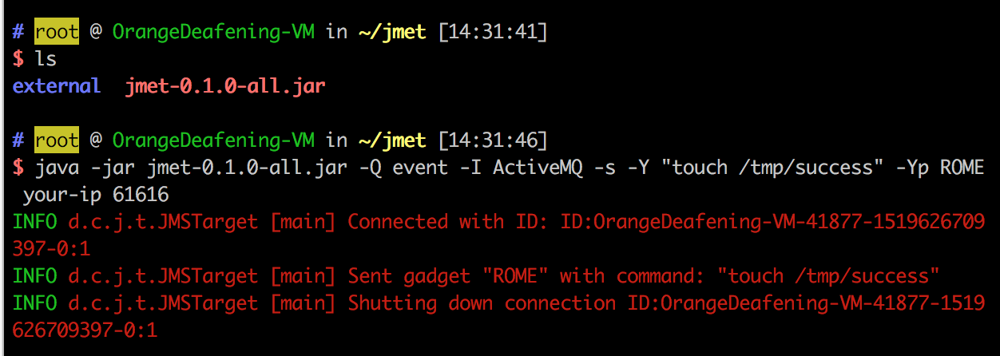
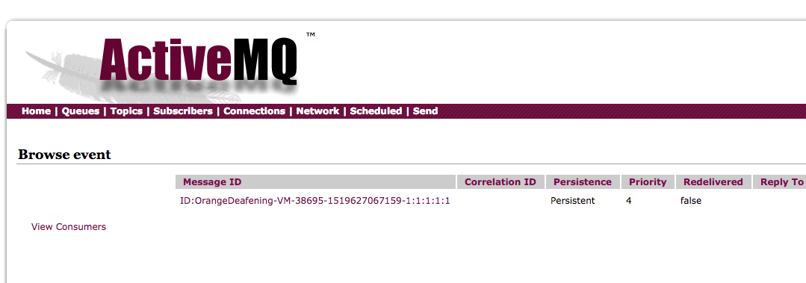
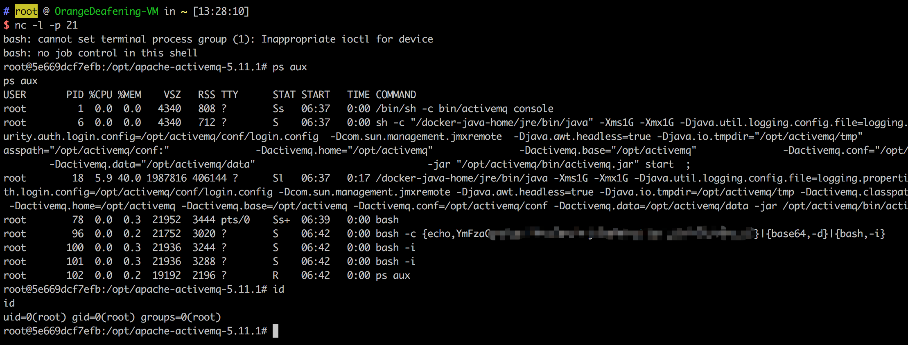

# ActiveMQ Deserialization Vulnerability (CVE-2015-5254)

Apache ActiveMQ is an open source messaging middleware developed by the Apache Software Foundation. It supports Java messaging services, clustering, and Spring Framework.

A security vulnerability exists in the 5.x release of Apache ActiveMQ 5.13.0, which stems from a program that does not restrict the classes that can be serialized in the proxy. A remote attacker can exploit this vulnerability to execute arbitrary code with a specially crafted serialized Java Message Service (JMS) ObjectMessage object.

Reference link:

- https://www.blackhat.com/docs/us-16/materials/us-16-Kaiser-Pwning-Your-Java-Messaging-With-Deserialization-Vulnerabilities.pdf

## Vulnerability environment

Run the vulnerability environment:

```
docker-compose up -d
```

After the environment is running, it will listen to the two ports of 61616 and 8161. Among them, 61616 is the working port, and the message is delivered on this port; 8161 is the web management page port. You can see the web management page by visiting `http://your-ip:8161`, but this vulnerability does not require web in theory.

## Vulnerability recurrence

The exploit process is as follows:

1. Construct (you can use ysoserial) serialized objects of executable commands
2. As a message, send to port 61616
3. Access the web management page, read the message, trigger the vulnerability

Use [jmet] (https://github.com/matthiaskaiser/jmet) for exploits. First download the jar file of jmet, and create an external folder in the same directory (otherwise it may explode the error that the folder does not exist).

The jmet principle is to use ysoserial to generate Payload and send it (the jar comes with ysoserial, no need to download it yourself), so we need to choose one that can be used in ysoserial is the gadget, such as ROME.

carried out:

```
java -jar jmet-0.1.0-all.jar -Q event -I ActiveMQ -s -Y "touch /tmp/success" -Yp ROME your-ip 61616
```



At this point, we will add a queue named event to the target ActiveMQ. We can see all the messages in this queue through `http://your-ip:8161/admin/browse.jsp?JMSDestination=event`:



Click to view this message to trigger the command execution. At this point, enter the container `docker-compose exec activemq bash`, and the /tmp/success is successfully created, indicating that the exploit is successful:


Replace the command with a shell statement and reuse it:



It's worth noting that accessing messages through the web administration page and triggering the vulnerability requires administrator privileges. In the absence of a password, we can induce the administrator to access our link to trigger, or pretend to be a message for other legitimate services, triggered when waiting for client access.