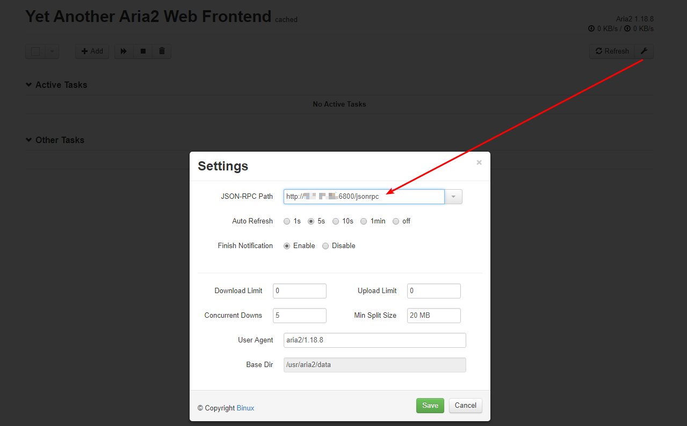
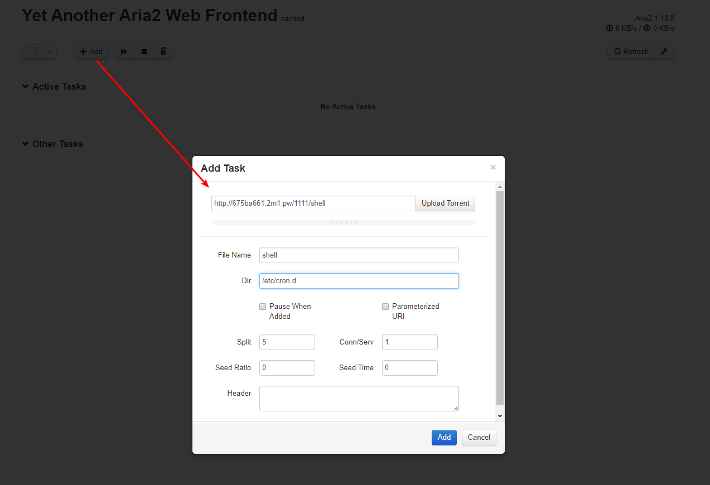

# Aria2 Arbitrary File Write Vulnerability

Aria2 is a lightweight, multi-protocol, multi-source download tool (supports HTTP/HTTPS, FTP, BitTorrent, Metalink) with built-in XML-RPC and JSON-RPC interfaces. In the case of permission, we can use the RPC interface to operate aria2 to download files and download the files to any directory, causing an arbitrary file write vulnerability.

Reference article: [https://paper.seebug.org/120/][1]

## Environment Building

Start the vulnerability environment:

```
Docker-compose up -d
```

6800 is the default port of aria2's rpc service. After the environment is started, access `http://your-ip:6800/`, and the service is started and returns 404 page.

## Vulnerability recurrence

Because rpc communication requires json or xml, it is not convenient, so we can use a third-party UI to communicate with the target, such as http://binux.github.io/yaaw/demo/.

Open yaaw, click the Configure button and fill in the target domain name for running aria2: `http://your-ip:6800/jsonrpc`:



Then click Add to add a new download task. Fill in the directory to which you downloaded to Dir and fill in the file name in File Name. For example, we bounce the shell by writing a crond task:



At this time, arai2 will download the malicious file (the URL I specified) to the /etc/cron.d/ directory, and the file name is shell. In debian, all files in the /etc/cron.d directory will be read as a scheduled task configuration file (like crontab), and wait for less than a minute to successfully bounce the shell:


> If the bounce is unsuccessful, note the format of the crontab file, and the newline must be `\n`, and a newline is required at the end of the file.

Of course, we can also try to write other files, more ways to use can refer to [this article][1]

[1]: https://paper.seebug.org/120/