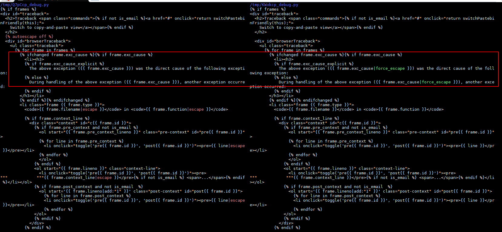
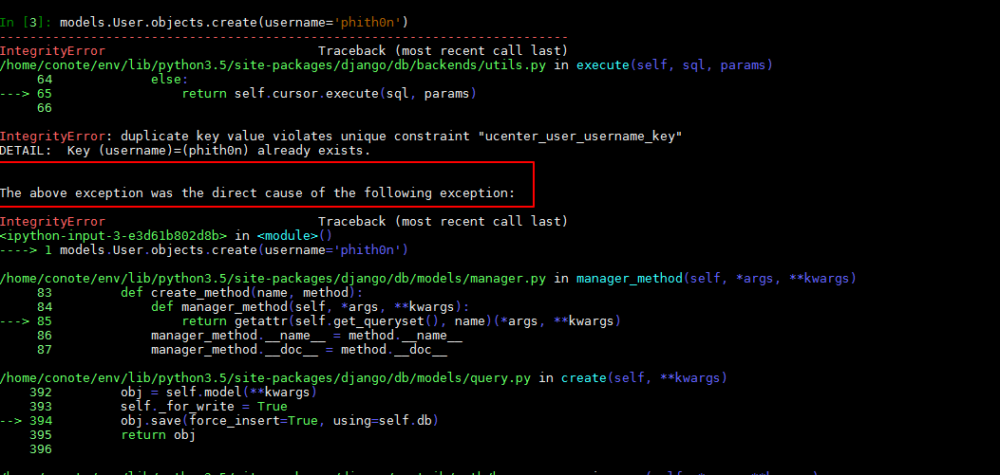

# Django debug page XSS Vulnerability (CVE-2017-12794) Analysis

Django released a new version 1.11.5, which fixes an XSS vulnerability that may exist in 500 pages. This article explains the principle and recurrence of the vulnerability, and my comments.

## 0x01 Patch Analysis

Because the official description is a bug in the 500 page, so we focus on `django/views/debug.py`.

There is a Django repository on Github, download it and compare it with 1.11.4 and 1.11.5:

```bash
Git clone https://github.com/django/django.git
Cd django
Git diff 1.11.4 1.11.5 django/views/debug.py
```



As you can see, the global escaping is turned off externally, and then forced escaping is added in both places. Then, the vulnerability must be triggered at this location.

## 0x02 Function Point Exploration

If you want to trigger these two output points, you must enter this if statement: ``.

First of all, let's think about it. Under normal circumstances, this location is used, that is, what is the function point.

As an old Django developer, I saw the key sentence of the picture box `The above exception was the direct cause of the following exception:`, I am impressed: generally in the event of a database exception, will throw such a Error statement.

We can do a simple test. Under the Django command line, we create a user whose username is phith0n, and then create a user whose username is phith0n, and throw an `IntegrityError` exception:



See the figure above, the reason is that the database exception is triggered.

Why does Django introduce such an exception mechanism? This is to facilitate developers to debug SQL errors, because Django's model is ultimately to operate the database, what is wrong in the database, Django can not be 100% predicted. Then, in order to facilitate the developer to quickly find out which operation triggered the database exception, you need to associate the two exception backtracking stacks together.

Let's take a look at the code, ``__exit__` function of `django/db/utils.py`:

```python
Def __exit__(self, exc_type, exc_value, traceback):
    If exc_type is None:
        Return
    For dj_exc_type in (
            DataError,
            OperationalError,
            IntegrityError,
            InternalError,
            ProgrammingError,
            NotSupportedError,
            DatabaseError,
            InterfaceError,
            Error,
    ):
        Db_exc_type = getattr(self.wrapper.Database, dj_exc_type.__name__)
        If issubclass(exc_type, db_exc_type):
            Dj_exc_value = dj_exc_type(*exc_value.args)
            Dj_exc_value.__cause__ = exc_value
            If not hasattr(exc_value, '__traceback__'):
                Exc_value.__traceback__ = traceback
            # Only set the 'errors_occurred' flag for errors that may make
            # the connection unusable.
            If dj_exc_type not in (DataError, IntegrityError):
                Self.wrapper.errors_occurred = True
            Six.reraise(dj_exc_type, dj_exc_value, traceback)
```

Where `exc_type` is an exception. If its type is one of `DataError, OperationalError, IntegrityError, InternalError, ProgrammingError, NotSupportedError, DatabaseError, InterfaceError, Error`, throw a new exception of the same type and set its `__cause__` and `__traceback__` is the `exc_value` and `traceback` of the context at this time.

`exc_value` is the description of the previous exception, `traceback` is the backtracking stack of the previous exception. This function is actually associated with the previous exception and the current new exception.

Finally, in the 500 page, `__cause__` is output.

## 0x03 Vulnerability recurrence

After my testing, I found that when using the Postgres database and triggering an exception, psycopg2 will throw all the field names and field values. Then, if the field value contains our controllable string, and because it is said in 0x02, the string will be set to `__cause__` and finally displayed on the page.

So let's assume the following scenario:

1. User registration page, no user name checked
2. Register a user with the username `<script>alert(1)</script>`
3. Register another user with the username `<script>alert(1)</script>`
4. Triggering duplicate key exception, causing XSS vulnerability

I organized the above process into an environment of vulhub: https://github.com/phith0n/vulhub/tree/master/django/CVE-2017-12794

Compile and start the environment:

```
Docker-compose build
Docker-compose up -d
```

Access `http://your-ip:8000/create_user/?username=<script>alert(1)</script>` to create a user, successful; access again `http://your-ip:8000/create_user/ ?username=<script>alert(1)</script>`, triggering an exception:


It can be seen that the exception thrown by Postgres is

```
Duplicate key value violates unique constraint "xss_user_username_key"
DETAIL: Key (username)=(<script>alert(1)</script>) already exists.
```

This exception is spliced ​​into `The above exception ({{ frame.exc_cause }}) was the direct cause of the following exception`, and finally the XSS is triggered.