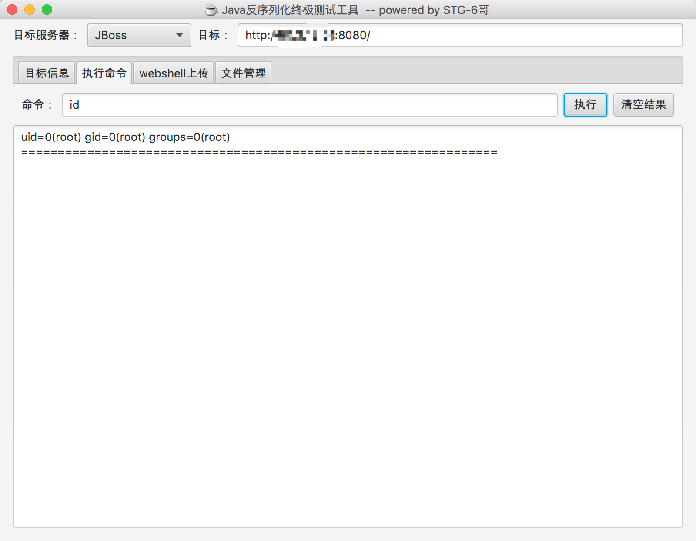

# JBoss JMXInvokerServlet Deserialization Vulnerability

This is the classic JBoss deserialization vulnerability. JBoss reads the object passed in by the user in the `/invoker/JMXInvokerServlet` request, and then we use the Gadget in Apache Commons Collections to execute arbitrary code.

Reference documentation:

 - https://foxglovesecurity.com/2015/11/06/what-do-weblogic-websphere-jboss-jenkins-opennms-and-your-application-have-in-common-this-vulnerability/
 - https://www.seebug.org/vuldb/ssvid-89723
 - http://www.freebuf.com/sectool/88908.html
 - https://paper.seebug.org/312/

## vulnerability environment

Start the vulnerability environment

```
Docker-compose up -d
```

The first time you execute it, it will take 1~3 minutes to initialize. After the initialization is completed, you can see the JBoss default page by visiting `http://your-ip:8080/`.

## Vulnerability recurrence

JBoss reads the object when processing the `/invoker/JMXInvokerServlet` request, so we can directly send the generated POC of [ysoserial] (https://github.com/frohoff/ysoserial) to the POST Body. The whole process can be referred to [jboss/CVE-2017-12149] (https://github.com/vulhub/vulhub/tree/master/jboss/CVE-2017-12149), I will not repeat them.

There are already a lot of EXPs on the Internet, such as [DeserializeExploit.jar] (https://cdn.vulhub.org/deserialization/DeserializeExploit.jar), you can use the tool to execute commands and upload files:

