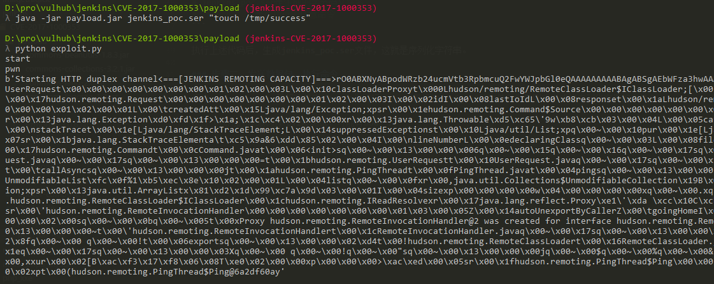

# Jenkins-CI Remote Code Execution Vulnerability (CVE-2017-1000353)

## Principle

Read more https://blogs.securiteam.com/index.php/archives/3171

## Test environment construction

Test environment compile and run:

```
Docker-compose build
Docker-compose up -d
```

The initial password will be required for the first run. By default, the `/ker/compose exec jenkins cat /var/jenkins_home/secrets/initialAdminPassword` can be read in the `/var/jenkins_home/secrets/initialAdminPassword` file.

The vulnerability can be triggered by default, no need to log in, and no other configuration.

## Testing process

### Step one, generate a serialized string

The files needed to compile the payload are in the payload directory. There are mainly the following files:

 - Payload.java generates Java source code for Payload
 - payload.jar generates completed Payload
 - *.jar Dependency library required to compile/run the above source code
 - exploit.py to send Payload to the target software

Because I have compiled the payload.jar, there is no need to compile (of course you can also try to compile, anyway, the source code is there). Directly execute the following command to generate a bytecode file:

```bash
Java -jar payload.jar jenkins_poc.ser "touch /tmp/success"
# jenkins_poc.ser is the generated bytecode file name
# "touch ..." is any command to be executed
```

After executing the above code, the jenkins_poc.ser file is generated, which is the serialized string.

### Step 2, send the data packet, execute the command

Modify the exploit.py. First, modify the URL to be your target URL. Second, modify the file name of FILE_SER to the file name of the serialization file you just generated.

Execution (I used py3 successfully, py2 did not test, there may be BUG):



Enter docker and find that `/tmp/success` was successfully created, indicating that the command execution exploit was successful:

