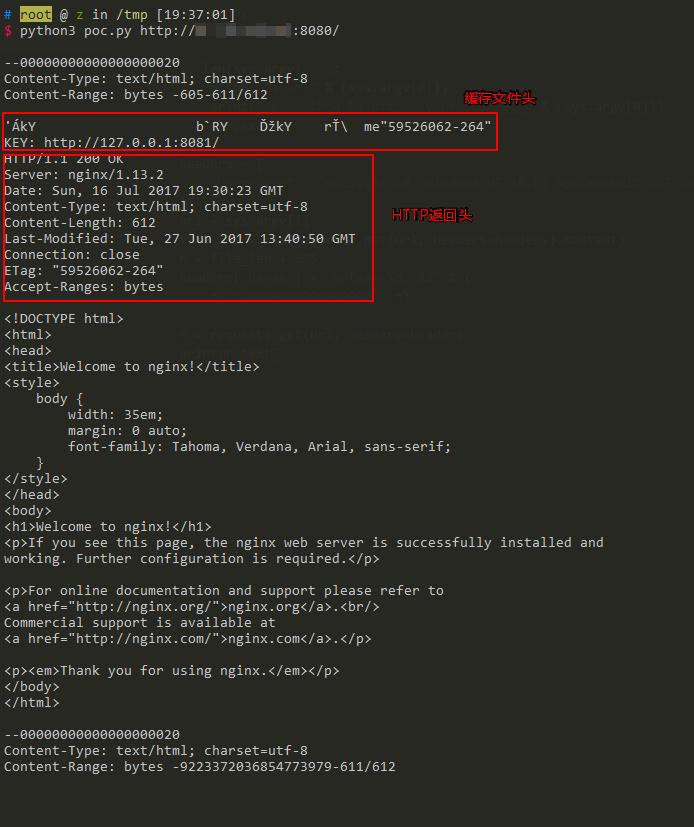

# Nginx Cross Border Read Cache Vulnerability (CVE-2017-7529)

## Vulnerability Principle

Reference reading:

 - https://cert.360.cn/detailnews.html?id=b879782fbad4a7f773b6c18490d67ac7
 - http://galaxylab.org/cve-2017-7529-nginx%E6%95%B4%E6%95%B0%E6%BA%A2%E5%87%BA%E6%BC%8F%E6%B4 %9E%E5%88%86%E6%9E%90/

When Nginx is in the reverse proxy site, it usually caches some files, especially static files. The cached parts are stored in files, and each cache file includes "file header" + "HTTP return header" + "HTTP return package". If the secondary request hits the cache file, Nginx will directly return the "HTTP return package" in the file to the user.

If my request contains a Range header, Nginx will return the specified length based on the start and end positions I specified. And if I construct two negative positions, such as (-600, -9223372036854774591), it will be possible to read the data in the negative position. If the request hits the cache file again, it may be able to read the "file header" and "HTTP return header" in the cache file before the "HTTP return package".

## Recurring vulnerabilities

Run the test environment:

```
Docker-compose up -d
```

Visit `http://your-ip:8080/` to see the Nginx default page, which is actually the content of the 8081 port of the reverse proxy.

Call `python3 poc.py http://your-ip:8080/` to read the result:



It can be seen that the content of the "file header" and "HTTP return header" located before the "HTTP return package" is read out of the boundary.

If the reading is incorrect, adjust the offset address in poc.py (605).