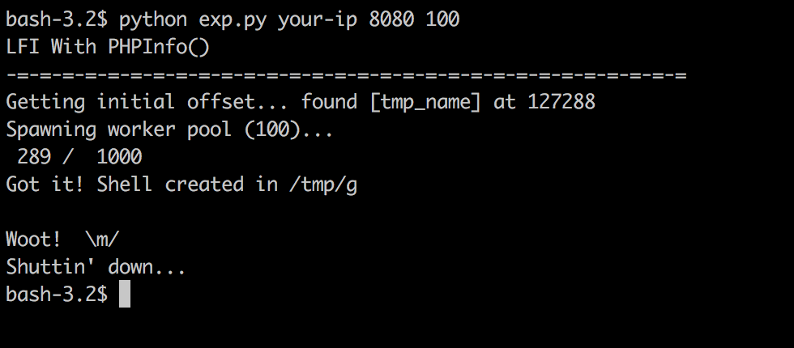

# PHP file contains vulnerabilities (using phpinfo)

The PHP file contains the vulnerability. If we can't find the file that can be included, we can get the shell by including the temporary file. Because the temporary file name is random, if phpinfo exists on the target website, you can use phpinfo to get the temporary file name and then include it.

Reference link:

- https://dl.packetstormsecurity.net/papers/general/LFI_With_PHPInfo_Assitance.pdf

## vulnerability environment

Run the following command to start the environment:

```
Docker-compose up -d
```

The target environment is the official latest version of PHP 7.2, indicating that the vulnerability is not related to the PHP version.

After the environment starts, visit `http://your-ip:8080/phpinfo.php` to see a PHPINFO page, visit `http://your-ip:8080/lfi.php?file=/etc/passwd `, it is obvious that there are files containing vulnerabilities.

## Brief description of the method of use

When sending a POST packet to PHP, if the packet contains a file block, PHP will save the file as a temporary file (usually `/tmp/php) regardless of whether the code you are accessing handles the file upload logic. [6 random characters]`), the file name can be found in the `$_FILES` variable. This temporary file will be deleted after the request ends.

At the same time, because the phpinfo page will print out all the variables in the current request context, if we send a packet containing the file block to the phpinfo page, we can find the contents of the `$_FILES` variable in the return package. Contains the temporary file name.

When the file contains a vulnerability and no files are available, you can use this method to find the temporary file name and include it.

But the file contains the vulnerability and the phpinfo page is usually two pages. In theory, we need to send the packet to the phpinfo page first, then match the temporary file name from the return page, and then send the file name to the file containing the vulnerability page for getshell. . At the end of the first request, the temporary file is deleted and the second request naturally cannot be included.

At this time, conditional competition is required. The specific process is as follows:

1. Send the upload data package containing webshell to the phpinfo page. The header, get, etc. of this data packet need to be filled with garbage data.
2. Because the phpinfo page will print all the data, the junk data in 1 will make the entire phpinfo page very large.
3. The default output buffer size of php is 4096, which can be understood as php returning 4096 bytes to the socket connection each time.
4. So, we directly manipulate the native socket, reading 4096 bytes at a time. As soon as the read character contains a temporary file name, the second packet is sent immediately.
5. At this point, the socket connection of the first packet is actually not finished, because php continues to output 4096 bytes each time, so the temporary file has not been deleted yet.
6. Using this time difference, the second packet, that is, the file containing the exploit, can successfully contain the temporary file, and finally getshell

## Vulnerability recurrence

The above process is implemented using the script [exp.py](exp.py). After the temporary file is successfully included, `<?php file_put_contents('/tmp/g', '<?=eval($_REQUEST[1]) is executed. ?>')?>`, write a new file `/tmp/g`, this file will remain on the target machine forever.

Execute with python2: `python exp.py your-ip 8080 100`:



It can be seen that the write is successful when the 289th packet is executed. Then, with lfi.php, you can execute arbitrary commands:

