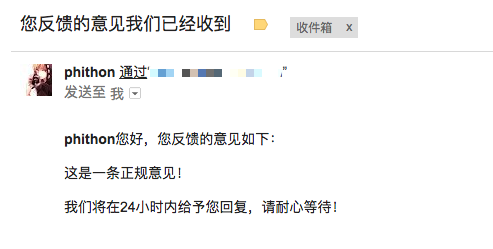
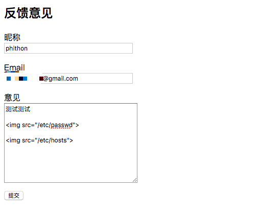
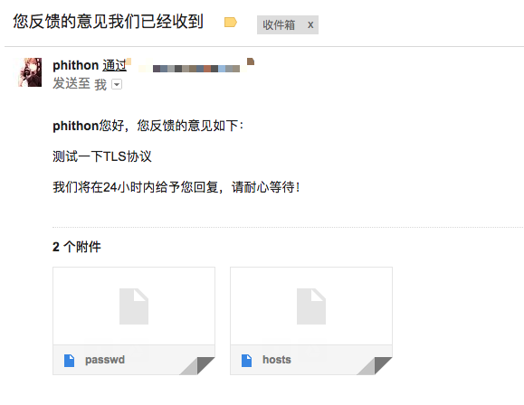

# PHPMailer Arbitrary File Read Vulnerability (CVE-2017-5223)

## Vulnerability Principle

In the process of sending mail, PHPMailer looks for the image tag (``) in the content of the message, and extracts the value of its src attribute as an attachment. So, if we can control some of the mail content, we can use `` to read the file `/etc/passwd` as an attachment, causing any file read vulnerability.

 - http://www.freebuf.com/vuls/124820.html
 - https://www.exploit-db.com/exploits/43056/

## vulnerability environment

Create the file `.env` in the current directory, the content is as follows (change the configuration value to your smtp server, account, password):

```
SMTP_SERVER=smtp.example.com
SMTP_PORT=587
SMTP_EMAIL=your_email@example.com
SMTP_PASSWORD=secret
SMTP_SECURE=tls
```

Among them, `SMTP_SECURE` is SMTP encryption, you can fill in none, ssl or tls.

Then compile and run the test environment:

```
Docker-compose build
Docker-compose up -d
```

After the environment starts, visit `http://your-ip:8080/` and you will see a "Feedback" page.

## Vulnerability recurrence

On the “Feedback” page, the normal user fills in the nickname, email, and opinion submission. The information will be stored by the backend, and the backend will send an email to prompt the user to complete the comments:



> This scenario is very common in actual combat. For example, after the user registers the website successfully, he usually receives a notification email containing his own nickname. Then, we insert the malicious code ` in the nickname. `, the file on the target server will be read as an attachment.

Again, we fill in the malicious code in the "Opinions" position:



Received the message containing the attachments `/etc/passwd` and `/etc/hosts`:



Download and read.