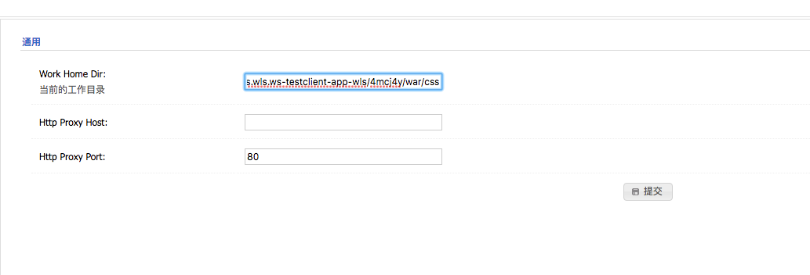
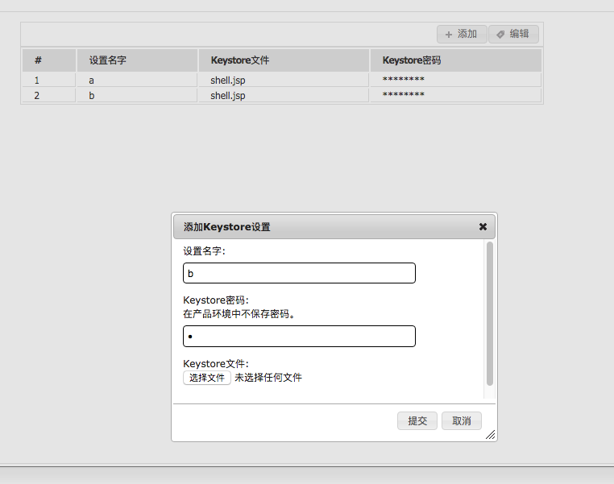

# Weblogic Arbitrary File Upload Vulnerability (CVE-2018-2894)

In the Oracle July update, an arbitrary file upload vulnerability in the Weblogic Web Service Test Page was fixed. The Web Service Test Page is not enabled by default in Production Mode, so this vulnerability has certain limitations.

With this vulnerability, you can upload any jsp file to get server permissions.

Reference link:

- http://www.oracle.com/technetwork/security-advisory/cpujul2018-4258247.html
- https://mp.weixin.qq.com/s/y5JGmM-aNaHcs_6P9a-gRQ
- https://xz.aliyun.com/t/2458

## vulnerability environment

Run the following command to start weblogic 12.2.1.3:

```
Docker-compose up -d
```

After the environment is started, visit `http://your-ip:7001/console` to see the background login page.

Execute `docker-compose logs | grep password` to view the administrator password. The administrator username is `weblogic`.

Log in to the background page, click on the configuration of `base_domain`, and in the "Advanced" open the "Enable Web Service Test Page" option:


## Vulnerability recurrence

Go to `http://your-ip:7001/ws_utc/config.do` and set the Work Home Dir to `/u01/oracle/user_projects/domains/base_domain/servers/AdminServer/tmp/_WL_internal/com.oracle.webservices. Wls.ws-testclient-app-wls/4mcj4y/war/css`. I set the directory to the css directory of the `ws_utc` application's static file. It is important to access this directory without permission.



Then click on Security -> Add and upload the webshell:



After uploading, view the returned packet with a timestamp:


Then go to `http://your-ip:7001/ws_utc/css/config/keystore/[timestamp]_[filename]` to execute the webshell:

