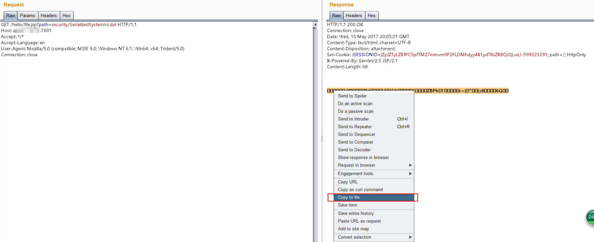
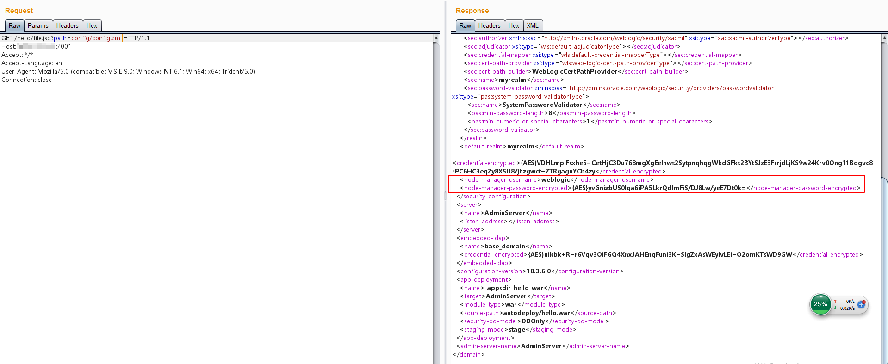
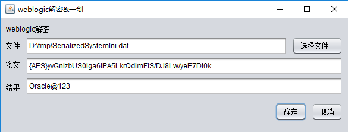
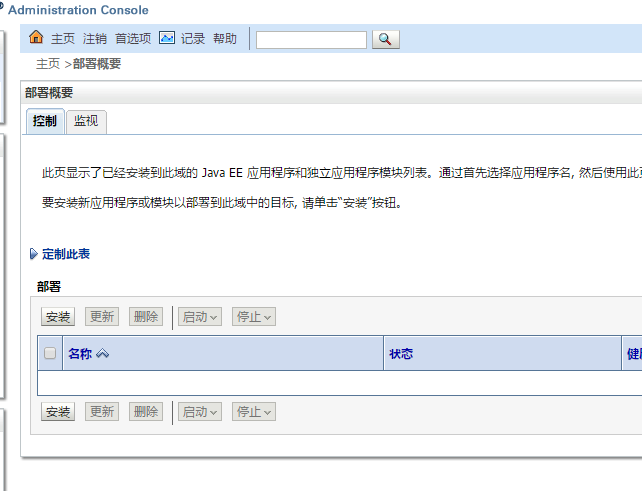
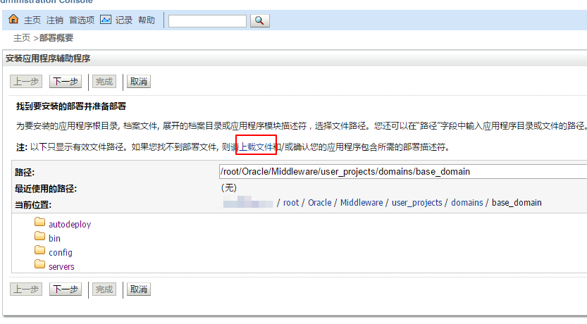
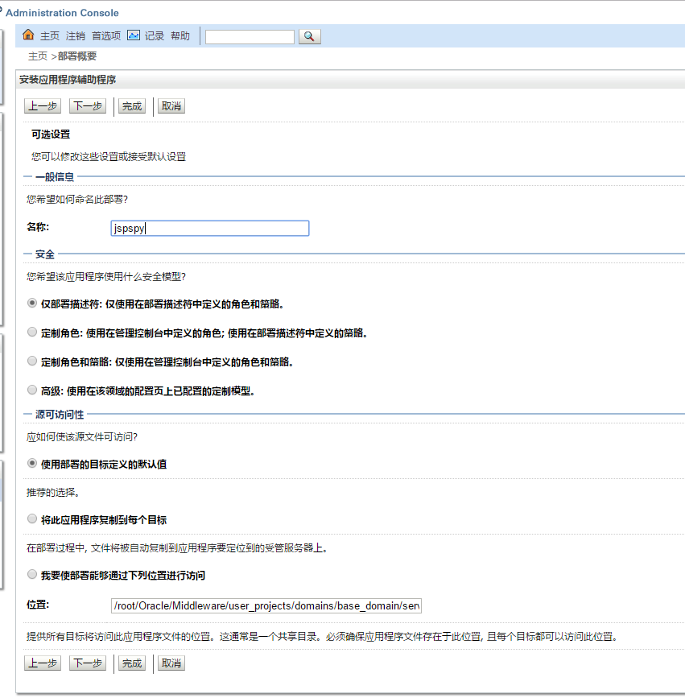
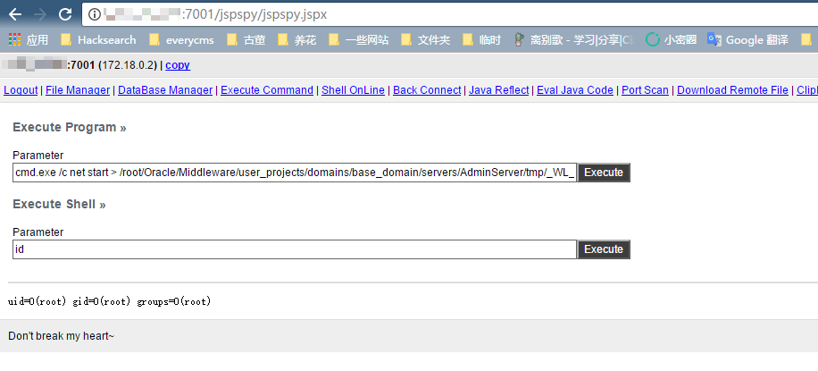

# Weblogic General Penetration Test Environment

## test environment

This environment simulates a real weblogic environment with a weak password in the background and an arbitrary file read vulnerability in the foreground. Through these two vulnerabilities, the penetration of the weblogic scene is simulated.

Weblogic version: 10.3.6 (11g)

Java version: 1.6

Start this environment:

```
Docker-compose up -d
```

## weak password

After the environment starts, visit `http://your-ip:7001/console`, which is the weblogic background.

There are weak passwords in this environment:

 - weblogic
 - Oracle@123

Weblogic commonly used weak password: http://cirt.net/passwords?criteria=weblogic

## Utilization of arbitrary file read vulnerabilities

Assuming there is no weak password, how to infiltrate weblogic?

This environment foreground simulates an arbitrary file download vulnerability. You can see the successful access to the passwd file by visiting `http://your-ip:7001/hello/file.jsp?path=/etc/passwd`. So how is the vulnerability exploited?

### Read background user ciphertext and key file

The weblogic password is encrypted with AES (old version 3DES). Symmetric encryption can be decrypted. You only need to find the user's ciphertext and the encryption key. Both files are located under base_domain, named `SerializedSystemIni.dat` and `config.xml`, in this environment are `./security/SerializedSystemIni.dat` and `./config/config.xml` (based on the current Directory `/root/Oracle/Middleware/user_projects/domains/base_domain`).

`SerializedSystemIni.dat` is a binary file, so be sure to use Burpsuite to read it. Direct download using a browser may introduce some disturbing characters. In the brp, select the garbled code that was read, and right-click copy to file to save it as a file:



`config.xml` is the global configuration file for base_domain, so there is a lot of messy content. Find the value of `<node-manager-password-encrypted>`, which is the encrypted administrator password. Don't get it wrong:



### Decrypting ciphertext

Then use the weblogic_decrypt.jar in the decrypt directory of this environment to decrypt the ciphertext (or refer to this article: http://cb.drops.wiki/drops/tips-349.html and compile a decryption tool yourself):



It can be seen that after decryption, it is consistent with my default password, indicating success.

## Background upload webshell

After getting the administrator password, log in to the background. Click on the deployment on the left to see a list of apps:



Click Install and select "Upload File":



Upload the war package. It is worth noting that the war package we usually use for tomcat may not be successful. You can put your webshell in the compressed package of `web/hello.war` of this project and upload it. After the upload is successful, click Next.

Fill in the application name:



Continue to the next step, and finally finish.

The application directory is specified in the WEB-INF/weblogic.xml in the war package (because the test environment already uses the `/hello` directory, so you need to modify the directory in this test environment, such as modifying it. /jspspy`):


Successfully get the webshell:

